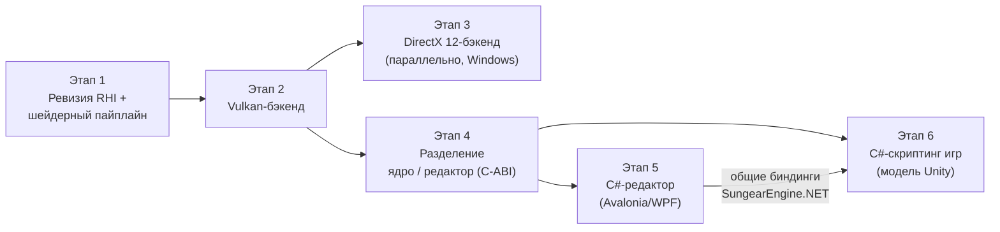

# 📅 IMPLEMENTATION_PLAN — План реализации проекта

## 📋 Оглавление

1. [Обзор проекта](#обзор-проекта)
2. [Текущий статус](#текущий-статус)
3. [Дорожная карта](#дорожная-карта)
4. [План работ по этапам](#план-работ-по-этапам)
5. [Открытые вопросы](#открытые-вопросы)
6. [Риски и зависимости](#риски-и-зависимости)
7. [Метрики успеха](#метрики-успеха)

> ⚠️ Раздел «Текущий статус» сверен с репозиторием на **2026-08-16**.
> Дорожная карта утверждена владельцем проекта 2026-08-16:
> **(1)** поддержка Vulkan и DirectX → **(2)** разделение ядра и редактора
> с явной границей API → **(3)** редактор на C# (XAML/MVVM) →
> **(4)** дальняя цель — C#-скриптинг игр по модели Unity.
> Документ живой — обновляется по мере выполнения задач.

---

## 🎯 Обзор проекта

### Цель проекта

**Sungear Engine** — open-source (Apache-2.0, до v0.14.0.8 — GPL-3.0)
кроссплатформенный игровой движок
на C++23, разрабатываемый командой Pixelfield. Текущая версия — **0.14.0.8**.

Стратегическое направление: уход от OpenGL как основного API к **Vulkan и
DirectX** (путь, пройденный Frostbite/Unity), и разделение движка на **ядро**
и **редактор** с явной границей обращения к ядру (по модели Unity:
нативное ядро + управляемый редактор через explicit-интероп).

### Ключевые компоненты

| Компонент | Технология | Статус | Где |
|-----------|------------|--------|-----|
| Ядро SGCore | C++23, EnTT | 🟡 Активная разработка | `Sources/SGCore/` |
| Графическая абстракция | `Graphics/API` (`IRenderer`, `GAPIType`) | ✅ Есть, скроена под GL | `Sources/SGCore/Graphics/API/` |
| OpenGL-бэкенды | GL4 / GL46 / GLES | ✅ Рабочие | `Graphics/API/GL/` |
| Vulkan-бэкенд | скелет 2023 г., без зависимости vulkan | 🔴 Заглушки | `Graphics/API/Vulkan/` |
| DirectX-бэкенд | — | ❌ Отсутствует | — |
| Редактор v1 / v2 | C++-плагины, ImGui | 🟡 В разработке | `Plugins/` |
| Редактор на C# | .NET, Avalonia/WPF (вопрос №3) | ⬜ Запланирован (этап 5) | — |
| C#-скриптинг игр | CoreCLR-хостинг, модель Unity | ⬜ Дальняя цель (этап 6) | — |
| Android-порт | GLES 3.2, NDK | ⚠️ Частично (без ввода) | `Sources/AndroidApp/` |
| Тесты | `Tests/Coro` | 🔴 Минимальные | `Tests/` |
| CI | — | ❌ Нет | — |

---

## 📊 Текущий статус

### Что уже есть для этапа рендера (✅ сверено с кодом)

- [x] Абстракция графического API: интерфейсы `IRenderer`, `IShader`,
  `ITexture2D`, `IFrameBuffer`, `IVertexArray`, `IUniformBuffer` и др.
  (`Graphics/API/*.h`); рендер-код движка ходит через них, а не в GL напрямую
- [x] Перечисление бэкендов `GAPIType`: GL4, GL46, GLES2, GLES3, VULKAN
  (DirectX-значений нет)
- [x] Каталог `Graphics/API/Vulkan/` — `VkRenderer`, `VkShader`, `VkTexture2D`
  и др.: **скелет без реализации**, `vulkan.h` закомментирован, зависимости
  в `vcpkg.json` нет
- [x] Окно/контекст: GLFW (умеет и GL-контекст, и Vulkan-сюрфейсы);
  в `Main/Window.cpp` ветка под `SG_API_TYPE_VULKAN` уже существует

### Известные пробелы инфраструктуры (⬜ фиксируются, закрываются попутно)

- [ ] CI-пайплайн сборки — сейчас проверка на авторе PR
- [ ] GTest заявлен в `vcpkg.json`, но не подключён в тестах
- [ ] `.clang-format` под CodingConvention.md отсутствует
- [ ] `copy_sgcore_dlls()` закомментирована — ручное копирование DLL
- [ ] README расходится с фактическими именами CMake-пресетов
- [ ] **JDK обязателен для сборки на всех платформах**, хотя JNI используется только под Android: `find_package(JNI REQUIRED)` в корневом CMake и `SungearEngineInclude.cmake`, безусловные `#include <jni.h>` в `ExternalAPI/Java/Main.h` (тянется `Window.h`), `JNIManager.h`, `FileUtils.cpp`; на ПК линкуется `jvm.lib` без надобности. Кандидат: сделать JNI Android-only (S, требует проверки Android-сборки)

---

## 🗺️ Дорожная карта

Порядок обоснован так:

1. **Сначала ревизия абстракции, потом бэкенды.** Текущий интерфейс скроен под
   OpenGL: `IVertexArray` — это VAO (концепция GL), `RenderState` — глобальное
   стейт-машинное состояние, юниформы сеттятся поимённо. У Vulkan/DX12 модель
   другая: command buffers, PSO (pipeline state objects), дескрипторы, явная
   синхронизация. Писать Vulkan-бэкенд под GL-образный интерфейс — значит
   переписывать его второй раз.
2. **Vulkan раньше DirectX.** Vulkan кроссплатформенный (Windows, Linux,
   Android — закрывает три наши платформы) и уже начат в коде. DX12
   концептуально близок к Vulkan — после первого «современного» бэкенда второй
   дешевле. При кроссплатформенном C#-редакторе (вьюпорт на Vulkan) DX12
   выходит из критического пути редактора и может идти параллельно этапам 4–5.
3. **Разделение ядра/редактора — после стабилизации рендера.** Граница API
   ядра должна фиксироваться, когда рендер-подсистема перестанет перетряхиваться.
4. **C-ABI граница капитализируется дважды.** Один и тот же слой
   `extern "C"` + C#-биндинги (`SungearEngine.NET`) обслуживает и редактор
   (C# *вызывает* ядро через P/Invoke), и — дальняя цель — скриптинг игр по
   модели Unity (ядро *хостит* CoreCLR и вызывает игровые сборки). Направление
   вызовов противоположное, фундамент общий.
5. **Ядро остаётся кроссплатформенным**, и выбор UI/скриптинга на C# этого не
   ломает: .NET работает на Windows/Linux/macOS, вьюпорт редактора — на
   Vulkan. Windows-only привязка возникла бы только от WPF
   (см. [открытый вопрос №3](#открытые-вопросы)).

---

## 🗓️ План работ по этапам

### Этап 1: Ревизия RHI и шейдерный пайплайн

**Цель**: интерфейс `Graphics/API`, под который можно честно реализовать
Vulkan и DX12, не ломая существующие GL-бэкенды; единый путь компиляции
шейдеров.

| Задача | Роль | Объём | Статус |
|--------|------|-------|--------|
| 1.1 Аудит `Graphics/API`: перечень GL-измов (VAO, глобальный RenderState, поимённые юниформы) и мест, где рендер-код обходит абстракцию → [RHI_AUDIT.md](./RHI_AUDIT.md) | @Senior Graphics Engineer | M | ✅ 2026-08-16 |
| 1.2 Спроектировать целевой RHI: command lists, PSO, дескрипторы/binding model, явные барьеры → [RHI_DESIGN.md](./RHI_DESIGN.md) | @Senior Graphics Engineer | L | 🟡 на утверждении |
| 1.3 Расширить `GAPIType` (`SG_API_TYPE_DX12`, хелперы `isOpenGLAPI`/`isExplicitAPI`), `GAPISelector` — список предпочтения, `SG_GAPI`, откат по доступности; хардкод в `CoreMain` заменён | @Senior C++ Engine Developer | S | ✅ 2026-08-17: собрано (MSVC 14.51, Debug), проверено запуском `SGSmokeTest --gapi gl4/gl46` — выбор бэкенда работает |
| 1.3a Рантайм-откат с пересозданием окна: если `confirmSupport()`/инициализация бэкенда провалилась после создания окна — уничтожить окно и перейти к следующему кандидату (сейчас GL-бэкенд при провале закрывает окно). Нужен, когда появится Vulkan-инициализация, которая может упасть | @Senior C++ Engine Developer | M | ⬜ (делать в 2.2) |
| 1.4a Проход «вулканизации» SGSL → Vulkan-GLSL: `Utils/SGSL/SGSLEVulkanizer` — 140+ свободных юниформов в один std140-блок (`SGLegacyUniforms`, члены видны под старыми именами — код шейдеров не меняется), авто-`set/binding` для сэмплеров/UBO/TBO с сохранением явных, `#if`-условия членов сохраняются (общий guard файла вырезается), `gl_FragColor`→`out`, `gl_VertexID`→`gl_VertexIndex`; биндинги едины для всех стадий программы. Тест `Tests/Shaders` (`SGShadersTest`): юнит-снипеты + прогон корпуса с дампом | @Senior Graphics Engineer | M | ✅ 2026-08-17: собрано; юнит PASS; корпус 24 файла / 50 стадий / 529 юниформов перенесено / 169 сэмплеров + 92 UBO забиндены, предупреждения только про макро-размеры массивов |
| 1.4b Компиляция в SPIR-V (glslang 15.1, target Vulkan 1.3 / SPIR-V 1.6) + рефлексия (SPIRV-Reflect) → `Graphics/SPIRV/{SPIRVCompiler, ShaderReflection}`: все стадии программы линкуются вместе (авто-локации in/out), рефлексия — объединение по стадиям (биндинги с масками стадий, члены блоков с offset/size, вершинные входы, push constants). Зависимости добавлены в `vcpkg.json` (согласовано 2026-08-17). Кеш по хешу и DXIL для DX12 — в 1.5/этап 3 | @Senior Graphics Engineer | L | ✅ 2026-08-17: **23/23 программ корпуса компилируются в SPIR-V без ошибок**; юнит-тест рефлексии (std140-offsets, массивы, маски стадий) PASS |
| 1.4d Пер-стадийные legacy-блоки: `SGLegacyUniforms_<stage>` с экземпляром `sg_<block>`, обращения переписаны в `instance.member`. Причина: стадия видит только свои типы (`screen.glsl` инклудит `uniform_bufs_decl.glsl` только в вершинной), а члены анонимных блоков живут в глобальном пространстве имён программы — glslang не линкует. Следствие для фасада: `useX("имя")` пишет во **все** блоки, где есть член | @Senior Graphics Engineer | — | ✅ решено в ходе 1.4b |
| 1.4c Найдено при прогоне: `features/pbr/instancing.sgshader` инклудит несуществующий `impl/glsl4/pbr/instancing.glsl` — мёртвый шейдер (0 стадий). Удалить или восстановить файл  **Закрыто 2026-08-22, вопрос к Ilya снят — файл оказался лишним, а не сломанным.** Инстансингу не нужен свой шейдер: `PBRRPInstancingPass` берёт `StandardMeshShader` и компилирует его с дефайном `SG_INSTANCED_RENDERING` (так же устроен проход декалей). Мёртвый `features/pbr/instancing.sgshader` инклудил несуществующий impl, давал 0 стадий и был зарегистрирован как `"InstancingShader"`, который никто не грузил — удалены и файл, и регистрация. ⚠️ Заодно исправлено вводящее в заблуждение имя: `impl/glsl4/instancing.glsl` — это не шейдер, а таблица локаций вершинных атрибутов (`SG_VS_*_ATTRIBUTE_LOC`, со сдвигом при `SG_INSTANCED_RENDERING`), её инклудят четыре реальных шейдера; переименован в `vertex_attributes_layout.glsl`. Корпус после правки: 23 файла, 48 стадий, SPIR-V 23/23 OK (было 24 и 50). ⚠️ Сам инстансинг при этом **непокрыт**: `Instancing`-компонент никто в репозитории не создаёт, ровно как было с `Batch` — нужен флаг `--instancing` у смоука по образцу `--batching` | @Senior Graphics Engineer | S | ✅ 2026-08-22 |
| 1.4e Три пред-существующие `[error]`-строки в логе любого запуска на `BasicApp` (не связаны с RHI): `SungearEngineConfig.json` не найден; **`no_material.sgmat`: Serde не находит член `m_useDataSerde` (схема `IMaterial` разошлась с ресурсом — материал грузится с дефолтами)**; ключ `enginePath` запрашивается до `CoreMain::init`. Первая и третья — косметика, вторая — реальный баг для Ilya | @Senior C++ Engine Developer | S | ⬜ вопрос к Ilya |
| 1.5a Каркас RHI в коде (`Graphics/RHI/`): `IDevice`, `ICommandList`, `ISwapchain`, `IGPUBuffer`, `IShaderProgram` (+`ShaderReflection`), `IPipelineState`/`PipelineStateDesc` (поверх существующих `RenderState`/`BlendingState`/`MeshRenderState`, хеш для кеша), `IDescriptorSet`, `RHITypes` (`DeviceProperties`, `VertexInputDesc`, `RenderPassBeginDesc`…). `IRenderer::getDevice()` | @Senior Graphics Engineer | M | ✅ 2026-08-17 |
| 1.5b GL46-реализация RHI (`GL/GL46/RHI/`): immediate-mode `GL46CommandList`, `GL46Device` с кешем PSO, `GL46PipelineState` (VAO из `VertexInputDesc` через DSA, буферы биндятся per-draw), `GL46GPUBuffer` (immutable storage, map/write), `GL46ShaderProgram` (GLSL из вулканизатора в OPENGL-диалекте, **рефлексия через program interface query** — источник истины для GL), `GL46DescriptorSet` (glBindBufferBase/glBindTextureUnit), `GL46Swapchain`. Вулканизатор получил `Target::OPENGL` (без `set=`, `gl_VertexID` сохраняется) — **один шейдерный путь для GL46 и Vulkan** | @Senior Graphics Engineer | L | ✅ 2026-08-17: `Tests/RHI` (`SGRHITest`) — треугольник через RHI в IFrameBuffer, UBO по рефлексии, readback: центр (0,127,0), угол = clear — PASS |
| 1.5c Миграция проходов на RHI под смоук-контролем. **Шаг 6 — текстуры: решение зафиксировано 2026-08-17** — юнит-модель проходов (22 места) не переписывается; для explicit-бэкендов её транслирует фасад с таблицей юнитов → `IDescriptorSet` по рефлексии (см. RHI_DESIGN «Состояние реализации»), делается вместе с Vulkan-устройством в 2.3. **Итог 1.5c на GL46: шейдеры, буферы, PSO, все 17 draw-точек, render targets, вывод на экран — через RHI; проходы не менялись; смоук 0 %.** **Шаг 5 — фреймбуферы ✅ 2026-08-17**: `GL46FrameBuffer` (оживлён пустой legacy-класс) исполняет `bind`/`bindAttachmentsToDrawIn`/`clear`/`clearAttachment`/`unbind` как RHI render pass — `ICommandList::beginRenderPass` (хендл FBO через `IFrameBuffer::getNativeHandle()`, draw buffers, viewport по правилам legacy) / новые `clearColorAttachment`/`clearDepthStencil` (аналог `vkCmdClearAttachments`) / `endRenderPass` (восстанавливает viewport окна как legacy `unbind`); смена draw buffers под биндом = перезапуск прохода с LOAD (форма, нужная Vulkan). 14 пар bind/unbind в 16 файлах проходов не тронуты; смоук 0 %. **Шаг 4 — legacy vertex arrays ✅ 2026-08-17**: `renderArray`/`renderArrayInstanced` (7 точек: батчинг, декали, инстансинг, дебаг-линии, текст, UI, тени) на GL46 идут через RHI: буферы `IVertexArray` оборачиваются не владеющими `GL46GPUBuffer` (по `getNativeHandle()`, кеш по хендлу — динамические буферы обновляются на месте), PSO из записанных атрибутов (слот на буфер, `perInstance` по divisor) + программа привязанного шейдера; смоук 0 %. **Все 17 точек отрисовки на GL46 теперь проходят через `ICommandList`.** **Шаг 3 — меши ✅ 2026-08-17**: `GL46Renderer::renderMeshData` (10 из 17 точек отрисовки во всех проходах) идёт через RHI: `IMeshData::m_rhi` — ленивое зеркало меша (`IGPUBuffer` вершин/цветов/индексов, `VertexInputDesc` из записанных `IVertexBuffer::getAttributes()`), PSO = программа текущего legacy-шейдера (`GL46LegacyProgram` поверх `GL46ProgramBase`) + кешированные состояния + раскладка меша, draw через `ICommandList`; откат на legacy VAO, если шейдер не привязан. 6 PSO на сцену смоука, 0 % расхождений. **Шаг 2 — шейдерный объект ✅ 2026-08-17**: `GL46Shader` в режиме `m_useRHIUniforms` (включает `GL46Renderer::createShader`) компилирует **вулканизированный** GLSL (OPENGL-диалект, биндинги с 8 — точки 1–4 заняты legacy-`IUniformBuffer`), рефлектит программу и маршрутизирует `useX("имя")` в UBO-блоки `SGLegacyUniforms_<stage>` по offset/stride (`name[i]` поддержан, запись во все блоки стадий); сэмплеры — как раньше через glUniform; инициализаторы (`pxRange = 6.0`) вычисляются из `Report::m_defaults`. **Все 23 программы движка теперь работают по Vulkan-модели данных без изменения проходов; смоук gl46 — 0 %.** **Шаг 1 — screen quad ✅ 2026-08-17**: `RHIShaderLoader` (`.sgshader` → транслятор → вулканизатор под диалект устройства → `IShaderProgram`; для explicit API — ещё и SPIR-V) и `ScreenBlit` (RHI-проход вывода текстуры на экран); `GL46Renderer::renderTextureOnScreen` идёт через него с откатом на legacy; `IRenderer::readScreenPixels()` для проверки. `SGRHITest` — экран = текстура байт в байт; `SGSmokeTest --gapi gl46` — PASS 0 %. Далее по порядку RHI_DESIGN: PBRRP geometry → CSM → PostProcess → остальные; `IShader` → `IShaderProgram`; push constants на GL через мини-UBO; удаление фасада  **Закрыто 2026-08-22**: единственным незакрытым пунктом оставался шаг 6 (текстуры), и он приехал вместе с таблицей юнитов `Graphics/RHI/TextureUnits` — на explicit-бэкендах она соединяется с рефлексией в `RHILegacyShader::buildDescriptorSet`, проходы по-прежнему не переписывались. Проверка: смоук на gl46 и gl4 против эталона — 0.000 %. | @Senior Graphics Engineer | L | ✅ 2026-08-22 |
| 1.6 Тестовая сцена-«смоук» `Tests/Smoke` (`SGSmokeTest`): PBR-тела, атмосфера, стохастическая прозрачность, SSAO; захват кадра в PNG, сравнение с эталоном (`--reference`, порог/доля), `--gapi`. Для захвата добавлен `IFrameBuffer::readAttachmentPixels()` (GL, в родном формате attachment'а) | @Senior C++ Engine Developer | M | ✅ 2026-08-17: собрано и запущено. GL4 детерминирован (повтор — 0 % расхождений). Эталон `Tests/Smoke/references/smoke_gl4_1920x1080.png` |
| 1.6a Тени в смоук-сцене: `SunShadowsPass` рендерит в каскады только `Batch`-сущности (`view<Batch, ShadowCaster>`), обычные меши теней не отбрасывают. Нужен ответ Ilya: правильный путь — вставка мешей в `Batch` с удалением `EnableMeshPass`, или тени для обычных мешей планируются отдельно. **2026-08-22**: путь через `Batch` теперь воспроизводим — `SGSmokeTest --batching` собирает непрозрачные меши сцены в батч и снимает с них `EnableMeshPass` (см. 3.6), так что вопрос можно проверить, а не только обсудить. Теней на кадре при этом всё равно нет — ни в батч-режиме, ни в обычном | @Senior Graphics Engineer | S | ⬜ вопрос к Ilya |
| 1.6b `GL46Renderer` был сломан (чёрный кадр, `GL_INVALID_ENUM`). Причины: `createShader()` не добавлял дефайн `SG_GLSL4` (весь код шейдеров под `#if` исчезал — отсюда «No input primitive type» и чёрный кадр) и заглушка `GL46Texture2D` 2023 г. (`GL_GENERATE_MIPMAP` через DSA, захардкоженный тип данных). **Решение 2026-08-17: GL46 — основной GL-бэкенд**; `GL46Renderer` = GL4-реализация на контексте 4.6 с `#version 460 core`, `GL46Texture2D` удалён (наследуется рабочий `GL4Texture2D`), DSA возвращается пообъектно при миграции на RHI. `GAPISelector`: GL46 перед GL4 | @Senior Graphics Engineer | M | ✅ 2026-08-17: смоук на `--gapi gl46` — PASS, попиксельно = GL4 (эталон `smoke_gl_1920x1080.png` общий) |

**Критерии готовности**:
- [ ] Документ RHI в SYSTEM_DESIGN утверждён командой
- [ ] GL46 работает через новый RHI, тестовая сцена рендерится идентично (эталонные скриншоты)
- [ ] Шейдеры из `Resources/` компилируются в SPIR-V офлайн или на старте

---

### Этап 2: Vulkan-бэкенд

**Цель**: рабочий Vulkan-бэкенд на Windows и Linux; Android — как расширение.

| Задача | Роль | Объём | Статус |
|--------|------|-------|--------|
| 2.1 Зависимости в `vcpkg.json`: `vulkan-headers`, `vulkan-loader` (не Android), `vulkan-memory-allocator` (baseline d5a87c6b: 1.4.309.0 / 3.3.0; volk не нужен — loader линкуется напрямую, `Vulkan::Loader`); подключены в корневом CMake, `SGCore/CMakeLists.txt` и `SungearEngineInclude.cmake` (плагины); INSTALL.md — Vulkan SDK (ради validation layers), RenderDoc | @Build Engineer | S | ✅ 2026-08-17 |
| 2.2 Инициализация: `RHI/VulkanContext` (instance 1.3 + `VK_LAYER_KHRONOS_validation` в Debug + debug utils, surface через `glfwCreateWindowSurface`, выбор GPU с graphics+present, device с dynamicRendering/synchronization2/`VK_EXT_depth_clip_control`, VMA), `RHI/VulkanSwapchain` (FIFO, ленивый acquire, present через `Window::swapBuffers`, 2 кадра в полёте), `VkRenderer::init/confirmSupport/prepareFrame`, `IRenderer::shutdown()` в конце цикла. **`SGRHITest --gapi vulkan` — PASS, код возврата 0**: readback attachment'а и экрана совпадают с GL46 байт в байт, ноль ошибок validation. Попутно вычищен порядок завершения процесса (падало `abort()` уже после PASS, в статической деструкции): `IRenderer::shutdown()` + реестр живых GPU-ресурсов в `VulkanContext`, `VkRenderer::getLiveDevice()` для фасадов вместо `getInstance()`, `AudioDevice::shutdown()`, `FontsManager` чистит шрифты до `deinitializeFreetype`. Регрессий на GL46 нет: `SGRHITest --gapi gl46` PASS, смоук 0.000 % | @Senior Graphics Engineer | L | ✅ 2026-08-17 |
| 2.3 Ресурсы: RHI на Vulkan **сделан** (`RHI/`: `VulkanDevice`, `VulkanGPUBuffer` (VMA), `VulkanTexture`, `VulkanShaderProgram` (SPIR-V + layout'ы по рефлексии), `VulkanPipelineState` (варианты по форматам прохода), `VulkanDescriptorSet` (транзиентные наборы), `VulkanCommandList` (dynamic rendering, transfer-буфер для аплоадов в проходе)); фасады `VkTexture2D` и `VkFrameBuffer` (render pass из bind/unbind, readback) — **сделаны**. **`VkShader` ✅ 2026-08-17**: компилирует все шейдеры движка на Vulkan (SGSL → вулканизатор `Target::VULKAN` → SPIR-V), UBO на каждый `SGLegacyUniforms_<stage>` (host-visible, запись по offset/stride из рефлексии, `name[i]` поддержан, дефолты из `Report::m_defaults`), **таблица юнитов** — `RHI/VulkanTextureUnits` (`bind(U)` → «юнит U = текстура») + `m_samplerUnits` (`useTextureBlock(name, U)` → «сэмплер name читает юнит U»), соединяются в `IDescriptorSet` по рефлексии в `buildDescriptorSet()`; `VkFrameBuffer::bindAttachment` делегирует в текстуру, как GL4. Попутно исправлены два дефекта: (1) `m_paddedSize` в SPIR-V-рефлексии — это должен быть страйд элемента массива (`array.stride`), а не размер всего члена (иначе `name[i]` пишет за пределы блока: 280 ошибок на смоуке); (2) аплоад текстуры сайзился по CPU-каналам, а копия — по VkFormat (невалидный `vkCmdCopyBufferToImage`; теперь `formatTexelSize` + отказ с диагностикой). Смоук на Vulkan доходит до рендер-проходов, **ноль ошибок validation**. **`VkUniformBuffer` ✅ 2026-08-17**: host-visible RHI-буфер + реестр `RHI/VulkanSharedUniformBuffers` по имени блока (общие UBO движка объявлены без явного `binding`, поэтому `setLayoutLocation` на Vulkan не значит ничего); создание общих UBO и `prepareUniformBuffers` перенесены из `GL4Renderer` в `IRenderer` — это данные движка, а не GL (GL46/GL4 после переноса: смоук 0.000 %). **Смоук на Vulkan отрабатывает сцену целиком: 60 кадров, exit 0, ноль ошибок validation — но кадр чёрный**, потому что геометрия ещё не отправляется. **Геометрия ✅ 2026-08-17 (частично)**: `VkVertexBuffer`/`VkIndexBuffer` над `VulkanGPUBuffer` (host-visible для динамических, device-local для статических), `VkRenderer::renderMeshData` строит PSO из программы привязанного `VkShader` + кешированных состояний + `IMeshData::m_rhi` и пишет **в командный список открытого прохода** (на Vulkan проход = один командный буфер), `useState`/`useBlendingState`/`useMeshRenderState` теперь запоминают состояние. Удалён `VkMeshData` — его заглушка переопределяла `IMeshData::prepare()` пустым телом, из-за чего у каждого меша не было буферов вершин (GL такого класса не имеет вовсе). **Смоук на Vulkan рисует геометрию**, но кадр ещё некорректный. **Текстуры материалов ✅**: `VkShader::isUniformExists` снимал индекс не там, где надо — `bindMaterialTextures` прерывает цикл на первом несуществующем `name[i]`, из-за чего отвязывались все текстуры материала; плюс dummy-текстура 1x1 (`VkRenderer::getDummyTexture`) для сэмплеров, которые проходы оставляют непривязанными (Vulkan запрещает draw с незаписанным дескриптором). **Сцена на Vulkan рисуется ✅ 2026-08-17**: геометрический проход даёт настоящий кадр (сфера, плоскость, перспектива, блик). Причина пустого кадра — **незаписанные дескрипторы**: проходы движка оставляют часть объявленных шейдером дескрипторов непривязанными (на GL безнаказанно), и драйвер отбрасывал draw целиком. Заполняются заглушками: 1x1 белая текстура для сэмплеров и одноэлементный uniform texel buffer для `samplerBuffer`. **Измерено 2026-08-17**: геометрический проход Vulkan против GL46 — **94 % пикселей расходятся** (цвета, отсутствующие объекты, ориентация), то есть постобработка не единственная проблема. Добавлены метки команд Vulkan (`vkCmdBeginDebugUtilsLabelEXT`) и `SG_VK_VALIDATION=1/0` для разбора в RenderDoc по проходам. **Сделано 2026-08-17 (продолжение)**: исправлен переворот кадра по вертикали — readback attachment'а отдаёт строки в порядке render target'а (строка 0 = NDC y = −1) **одинаково на всех бэкендах**, поэтому смоук переворачивает их для PNG безусловно, а не только для GL; реализованы `renderArray`/`renderArrayInstanced` (батчинг, декали, текст, UI, дебаг-линии) по образцу GL46. Расхождение с GL46 по геометрическому проходу: 94 % → 63 % после флипа. Реализованы `VkCubemapTexture` (шесть граней в слоях cube-изображения, RGB→RGBA как у 2D) и cube-поддержка в `VulkanTexture`. Проверено экспериментом: при полностью отключённом culling небо **всё равно не появляется** — значит скайбокс не отсекается, а не доходит до отрисовки (его шейдер при этом компилируется, модель грузится); зато проявляется лишняя зелёная поверхность, видимая только со стороны задних граней, — отдельный дефект winding у одного из объектов. **Установлено 2026-08-17 симметричной диагностикой**: оба бэкенда рисуют **идентичный набор мешей** (10 кубов по 24 вершины + 4 сферы), то есть объекты не теряются — куб, ящик и скайбокс на Vulkan выводятся почти белыми и сливаются с белым фоном. Опровергнуты: dummy-текстура (эксперимент с пурпурной заглушкой — ни одного пурпурного пикселя) и раскладка `AtmosphereBlock` (ручная упаковка движка совпадает со std140). Значит расхождение — на уровне затенения (значения uniform'ов материала/света в шейдере). **Сужено дальше (симметричный дамп записей в legacy-блоки)**: движок пишет **идентичные** значения на обоих бэкендах и они попадают в блоки (`found=true`) — цвета материалов (0.2/0.45/0.9 ящик, 0.9/0.85/0.3 сфера, 0.85/0.2/0.15 куб, 0.75³ плоскость) и матрицы моделей совпадают. Значит расхождение **не в данных, а в самом коде шейдера**: вулканизатор генерирует для `Target::VULKAN` другой GLSL, чем для `OPENGL` (явные set/binding, перезапись `gl_FragColor`→`sgFragColor` при том, что PBR-шейдер имеет свои `out` на locations 0–2). Гипотеза про `sgFragColor` **опровергнута**: вулканизатор добавляет его только при `scan.m_usesFragColor`, а PBR-шейдер объявляет свои восемь `out` на locations 0–7 и `gl_FragColor` не использует; захват RenderDoc подтверждает совпадение выходов с attachment'ами.

**Причина расхождения найдена и исправлена 2026-08-18 — юниформы, различающиеся по draw'ам, не снимались по draw'у.** `VkShader` держал один UBO на стадию и писал в него на месте; на GL это работает, потому что `glUniform*` попадает в программу немедленно, а на Vulkan draw только записывается и исполняется позже — поэтому все draw'ы прохода читали значения **последнего** из них, и сцена схлопывалась на трансформ и материал последнего объекта (в G-буфере оставался только пол; прозрачная сфера выживала лишь потому, что в своём проходе была одна). Теперь блок живёт в CPU-копии (`LegacyBlock::m_values`), а `buildDescriptorSet()` копирует его в срез арены устройства (`VulkanDevice::allocateTransientUniforms`, bump-аллокатор по чанкам, регионы ротируются в `prepareFrame`) и биндит этот offset. **Попутно исправлен readback**: `vkCmdCopyImageToBuffer` — сырое копирование, а объявленный `m_dataType` расходится с форматом образа (attachment'ы 4–6 — `SGG_RGB16_FLOAT` + `SGG_FLOAT`, реально `R16G16B16A16_SFLOAT`), из-за чего RGBA16F-вложения читались мусором и сравнения по ним давали ложные выводы; добавлен `VulkanTypesCaster::formatLayout` и покомпонентное декодирование. **Результат**: геометрический проход на Vulkan рисует сцену корректно — каждый объект со своим трансформом и материалом, тени и блик на месте, вложение нормалей структурно совпадает с GL46. `SGRHITest` — PASS на gl46 и vulkan, `SGSmokeTest --gapi gl46 --reference` — 0.000 %.

**Атмосфера ✅ 2026-08-18.** Небо на Vulkan было белым из-за двух дефектов, оба в общем коде. (1) `IShader::bindTextures` держал имена юниформов в function-local `static`, поэтому имя, вычисленное на первом вызове, использовалось для всех последующих слотов; кого именно затрёт — зависит от порядка первого вызова, а он у бэкендов разный. (2) В шейдере скайбокса ветка `if(mat_skyboxSamplers_CURRENT_COUNT > 0)` задавала только `skyboxCol.rgb`, оставляя alpha равной 0 от `vec4(0.0)` — фрагмент с нулевой альфой исчезал. Ветку выбирало расхождение `isUniformExists`: GL-линкер выбрасывает объявленный, но неиспользуемый `mat_skyboxSamplers` (его единственное обращение закомментировано) и отвечает «нет», а в SPIR-V ресурс с явным `binding` остаётся, причём **и `accessed`, и `used_uniforms` из SPIRV-Reflect считают его используемым** — воспроизвести GL-семантику из SPIR-V этим способом нельзя (проверено, попытка откачена). Обе ветки шейдера и так дают одинаковый цвет, поэтому вторая теперь тоже задаёт alpha. Измерено: геометрический проход Vulkan против GL46 — **47.272 % → 1.582 %**, GL46 против эталона — 0.000 %.

**Прозрачность ✅ 2026-08-18, геометрический проход сошёлся полностью.** Причина — незаписанные выходы фрагмента: `calculateStochasticTransparencyComponents` присваивала `outputSTColor`/`outputLayerColor` не на всех путях, а вызывающие не делают `discard` (он закомментирован). Незаписанный `out` по спецификации не определён: GL оставлял attachment нетронутым, Vulkan писал туда цвет фрагмента — прозрачные объекты протекали во вложение 1, а весь стохастический слой (вложение 3) заполнялся непрозрачной геометрией. Оба бэкенда вели себя законно, дефект был в шейдере; теперь оба выхода задаются на каждом пути, а «не трогать» attachment выражается alpha 0 при `SrcAlpha`-блендинге. Измерено: вложение 1 — 1.582 % → **0.000 %**, вложение 3 — 100 % → **0.108 %** (сам дизеринг), вложения 0, 2, 4, 5, 6, 7 — **0.000 %**, вложения 0 и 1 FX-фреймбуфера — **0.000 %**, GL46 против эталона — 0.000 %, `SGRHITest` — PASS на обоих.

**Постобработка, шаг 1 (2026-08-18)**: закрыты два разрыва семантики текстур, оба найдены сравнением с `GL4Texture2D`. (1) Attachment'ы фреймбуфера на GL создаются с `GL_NEAREST`, а на Vulkan создавались с `VK_FILTER_LINEAR`; это не косметика — проходы сравнивают сэмпл attachment'а **точным `==`** (гейт слоя в `layer_default_fx.glsl`), а интерполированный сэмпл не равен хранимому текселю почти нигде. (2) Свежий `VkImage` содержит неопределённые данные, тогда как GL-текстура без данных читается нулями, а движок на это опирается: все проходы идут с `LoadOp::SGG_LOAD`, а attachment'ы FX-фреймбуфера не очищаются вовсе — теперь образ очищается при создании. Регрессий нет: GL46 против эталона — 0.000 %, геометрия Vulkan против GL46 — 0.000 %, `SGRHITest` — PASS на обоих.

**Шум финального кадра найден и устранён ✅ 2026-08-18 — три дефекта, спрятанные друг под другом.** (1) Шум порождал `OutlinePass`: проход 3 всегда рисует полноэкранный квад во вложение 7 и там, где контура нет, не присваивал `outColor` — на GL вложение сохраняло цвет сцены, на Vulkan писалось неопределённое значение; теперь `outline.glsl` присваивает каждый выход на каждом пути, а «оставить цвет сцены» — `discard`. (2) Под шумом оказался чёрный кадр: FX-дро на Vulkan не записывались, потому что квады `PostProcessPass` — 6 индексов и ноль вершин (вершинный шейдер FX синтезирует квад из `gl_VertexID`), а `prepareMeshRHI` отвергал меш без вершин; теперь такой меш готовится без вершинного буфера и с пустым vertex input. (3) Под чёрным — белый: `PostProcessPass` задаёт сэмплеры вложений эффекта через `useInteger(name, unit)` (на GL сэмплер — int-юниформ), а `VkShader::useInteger` знал только legacy-блок, и сэмплеры `SG_SSAO_*` читали dummy-белую текстуру; теперь `useInteger` для имени, известного рефлексии как сэмплер, идёт в таблицу юнитов. Гипотеза про гейт `layer_default_fx.glsl:116` **опровергнута** экспериментом (принудительно открытый гейт картинку не менял). Ни один из трёх дефектов не виден по валидации: пропущенное дро не валидируется, а неопределённый выход фрагмента законен. **Измерено**: финальный кадр Vulkan против эталона GL46 — **100 % → 7.138 %** (max diff 255 → 77); Vulkan детерминирован от прогона к прогону (0.000 %); GL46 против эталона — 0.000 %; `SGRHITest` — PASS на обоих.

**Осталось**: (1) остаток 7.138 % — это SSAO: шумовая текстура SSAO создаётся `ITexture2D::create<float>` как `RGB16_FLOAT`, но `m_dataType` остаётся `UNSIGNED_BYTE` (create не выставляет его и копирует `w*h*размер_internalFormat` байт); GL заливает биты float как байты — детерминированный мусор, который **уже в эталоне**, Vulkan аплоад отклоняет и текстура пустая. Починка на стороне движка (float-данные → `SGG_FLOAT`) изменит GL-эталон — **решение за пользователем**; (2) `IShader::bindTextures` связывает текстуру с юнитом 0, а сэмплеру сообщает `samplersOffset` — расходящаяся пара, на юнит-модели Vulkan это даёт не ту текстуру; (3) ~~`renderArray` выдаёт `vkCmdDrawIndexed(0, 1)`~~ — ✅ 2026-08-18, пустой draw пропускается; (4) прогон `SGSmokeTest --gapi vulkan` иногда зависает при завершении (процесс не убивается, держит exe); (5) ~~имена attachment'ов~~ — ✅ 2026-08-18, в имя добавлены адрес фреймбуфера и размер. (6) ~~соответствие color-attachment'ов выходам шейдера~~ — ✅ 2026-08-18, см. задачу 2.5  **Закрыто 2026-08-22**: в «Осталось» висел только остаток SSAO, и он оказался не в ресурсах, а в шейдере — `ssao.glsl` умножал на матрицу вида весь vec4 из `u_GBufferWorldPos`, у которого альфа не пишется (см. 2.6). Смоук на Vulkan против эталона GL — 0.096 %, в допуск. | @Senior Graphics Engineer | L | ✅ 2026-08-22 |
| 2.4 PSO-кэш, дескрипторы, рендер-пассы под PBRRP (полный проход пайплайна: PBR, CSM, постпроцессинг) . **Сделано**: кеш PSO живёт в `VulkanDevice`/`DX12Device` (ключ — программа + состояния + форматы прохода), дескрипторы — транзиентные наборы, материализуемые на записи draw по версии набора, рендер-пассы — dynamic rendering на Vulkan и `OMSetRenderTargets` + явные clear на DX12. Полный проход PBRRP (PBR, CSM, постобработка, стохастическая прозрачность, SSAO, контур) идёт на обоих explicit-бэкендах: смоук против эталона GL — Vulkan 0.096 %, DX12 0.000 %; `SGRHITest` — PASS. | @Senior Graphics Engineer | L | ✅ 2026-08-22 |
| 2.5 Валидация: запуск со слоями Vulkan validation в Debug (`SUNGEAR_DEBUG`) — включается в `VulkanContext::createInstance`, сообщения в лог `[Vulkan validation]`; на `SGRHITest` чисто. **Смоук-сцена вычищена 2026-08-18: 43 сообщения → 9, ошибок нет вовсе.** Устранено: (1) шейдер скайбокса не писал `pickingColor` — undefined-значения шли в буфер пикинга (9); (2) вершинный layout меша объявлял атрибуты, которых программа не читает — `VulkanPipelineState` пересекает его с `getReflection().m_vertexInputs` (8); (3) текстура с отклонённым аплоадом оставалась в `UNDEFINED`, хотя её биндят и сэмплируют — теперь очищается и переводится в `SHADER_READ_ONLY` (8); (4) attachment, привязанный как сэмплер, пока проход в него же рисует, — проходы биндят все attachment'ы заранее и лишь потом выбирают цель; `materializeSet` подменяет такой дескриптор dummy-текстурой (`isPassAttachment`), а сам dummy переехал в `VulkanDevice`, потому что нужен и командному списку (9). Остаются 9 «write is unused»: шейдер контура мультиплексирует три прохода через одну программу, и в пайплайне прохода 3 привязан один attachment — статический анализ не смотрит на ветку, убирается только разделением шейдера. Регрессий нет: GL46 против эталона — 0.000 %, `SGRHITest` — PASS на обоих  **Закрыто 2026-08-22: на смоук-сцене ноль сообщений валидации** (было 9). Оставались предупреждения «write is unused» из шейдера контура: он мультиплексировал три прохода через одну программу, а в проходе 3 привязано одно вложение — статический анализ видел запись в location 1 из другой ветки и не мог знать, что она не выполняется. Шейдер разделён на два варианта одной программы дефайном `SG_OUTLINE_COMBINE` (как инстансинг делает `SG_INSTANCED_RENDERING`): проходы 1–2 объявляют оба выхода, проход 3 — только location 0. Смоук на всех четырёх бэкендах без изменений. | @Senior Graphics Engineer | S | ✅ 2026-08-22 |
| 2.6 Смоук-сцена из 1.6 на Vulkan = эталону GL46. **Сделано 2026-08-22** — и Vulkan, и DX12 проходят смоук против коммитнутого эталона `smoke_gl_1920x1080.png` с настройками по умолчанию: Vulkan — 0.096 % (max channel diff 52), DX12 — 0.000 % (max diff 2), gl46 и gl4 — 0.000 %. Эталон при этом **не сдвинулся**, правка на GL ничего не меняет. Причина разрыва (был 46.17 % у обоих explicit-бэкендов, весь во вложении 2 — окклюзии SSAO): `ssao.glsl` умножал на `camera.viewMatrix` **весь vec4** из `u_GBufferWorldPos`, а геометрический проход объявляет это вложение как `out vec3` — альфа-канал никто не пишет, и трансляционный столбец матрицы домножался на неопределённое значение. На GL там случайно оказывалась единица, на Vulkan/DX12 — мусор. Замерено пробниками: `.w` этого вложения расходится на 100 % пикселей (max 255), а с явной `vec4(..., 1.0)` вид-позиция становится бит-в-бит одинаковой (0.000 %, max 0). Исправлено в двух местах `ssao.glsl` (сама вид-позиция и `sampleDepth` в цикле окклюзии) — это весь корпус: остальные потребители G-буфера уже берут `.xyz`/`.rgb`. Остаток у Vulkan — 0.096 % во вложении 3 (стохастическая прозрачность, max 52), у DX12 его нет; отдельная мелкая задача | @Senior Graphics Engineer | M | ✅ 2026-08-22 |
| 2.7 (Расширение) Android: свопчейн без GLFW, проверка на устройстве | @Senior C++ Engine Developer | L | ⬜ |

**Критерии готовности**:
- [ ] Смоук-сцена и `SGEntry` работают на Vulkan на Windows и Linux
- [ ] Debug-сборка чиста от ошибок validation layers на смоук-сцене
- [ ] Выбор бэкенда GL/Vulkan — конфигурацией, без пересборки

---

### Этап 3: DirectX 12-бэкенд (Windows)

**Цель**: DX12-бэкенд, повторяющий функциональность Vulkan-бэкенда; основа
для интеропа с WPF-редактором (этап 5).

| Задача | Роль | Объём | Статус |
|--------|------|-------|--------|
| 3.1 Инфраструктура: ветка `SG_TARGET_OS_WINDOWS` в `Sources/SGCore/CMakeLists.txt` — `d3d12`/`dxgi`/`dxguid` берутся из Windows SDK, отдельного пакета не требуют, поэтому Agility SDK пока не нужен. `DX12Common` (`SG_DX_CHECK` + расшифровка `HRESULT` через системную таблицу сообщений) — двойник `VulkanCommon`. Зависимости vcpkg понадобятся только шейдерному пути (3.4): `spirv-cross` и `directx-dxc` | @Build Engineer | M | ✅ 2026-08-18 |
| 3.2 Инициализация: `DX12Context` — DXGI-фабрика, выбор адаптера (`EnumAdapterByGpuPreference` с предпочтением дискретной GPU, программный WARP отбрасывается, требуется FL 12.0), device, direct-очередь, слой отладки (`SG_DX_VALIDATION=1/0`, двойник `SG_VK_VALIDATION`) и слив его очереди сообщений в лог (`drainDebugMessages` — у слоя нет колбэка, как у `VK_EXT_debug_utils`). `DX12Renderer` подключён к `GAPISelector`. Свопчейн (2026-08-20): `DX12Swapchain` — HWND через `glfwGetWin32Window`, flip-discard, `R8G8B8A8_UNORM`, `Present(1,0)` (двойник FIFO), число буферов = числу кадров в полёте (2), `MakeWindowAssociation(NO_ALT_ENTER)`, пересоздание по размеру окна. Слой отладки получил **колбэк** (`ID3D12InfoQueue1::RegisterMessageCallback`) и слив очереди DXGI — до этого сообщения были невидимы. DX12 **убран из дефолтного списка предпочтения** (был там первым!): `createRenderer` теперь отдаёт рабочий объект, и незавершённый бэкенд стал бы дефолтом на Windows, отдавая пустой кадр; доступ через `SG_GAPI=dx12`, как у Vulkan | @Senior Graphics Engineer | L | ✅ 2026-08-20 |
| 3.3 Ресурсы и PSO поверх RHI (маппинг концепций 1:1 с Vulkan-бэкендом): `DX12Device` (одна direct-очередь + один монотонный фенс, id сабмишена = значение фенса; пул «аллокатор+список», кеш PSO, shader-visible куча-кольцо, staging/readback), `DX12CommandList` (проходы через `OMSetRenderTargets` + явные clear'ы, барьеры, вершинные/индексные буферы, дро, `uploadData` во второй список), `DX12GPUBuffer` (UPLOAD/DEFAULT), `DX12Texture` (трекер `D3D12_RESOURCE_STATES` + RTV/DSV), `DX12DescriptorSet` (CPU-таблица → дескрипторная таблица), `DX12PipelineState` (варианты под форматы прохода), `DX12ShaderProgram` (рефлексия SPIR-V + root signature; DXIL — 3.4), `DX12TypesCaster`. **Проверено**: `SGRHITest --gapi dx12` — PASS, выход 0 со включённым слоем отладки (устройство, свопчейн 960×540, host-visible буфер, проход в окно с очисткой обоими путями, readback бэкбуфера = цвету очистки, present); `--gapi vulkan` и `--gapi gl46` — PASS без регрессий. Осталось за 3.4/3.5: DXIL-путь, SRV текстур и sampler-таблицы, offscreen-проходы (нужны legacy-фасады), root constants | @Senior Graphics Engineer | L | ✅ 2026-08-20 (без шейдерной половины — она 3.4) |
| 3.4 Шейдеры: SPIR-V → HLSL (spirv-cross) → DXIL (**DXC, shader model 6.0**) — `DX12ShaderCompiler`. Попытка обойтись `d3dcompiler`/SM 5.1 провалилась на корпусе (FXC не разворачивает циклы volumetric_fog и terrain), поэтому вернулись к решению плана. **DXC не требует пакета vcpkg**: `dxcapi.h` и `dxcompiler.lib` идут в Windows SDK; `dxil.dll` не нужен — DXC из SDK подписывает DXIL сам (замерено: неподписанный DXIL рантайм отвергает с `E_INVALIDARG`, наш принимается). Рядом с exe нужен `dxcompiler.dll` (иначе подхватится чужой из Vulkan SDK через PATH). Из vcpkg добавлен только `spirv-cross` (`spirv_cross_hlsl` не грузится без `spirv_cross_glsl` — искать оба). **Регистры HLSL назначает движок, а не spirv-cross** (`DX12ShaderProgram::assignRegisters` → `add_hlsl_resource_binding`): массив сэмплеров занимает столько регистров, сколько элементов, поэтому «биндинг = регистр» давало «SRV binding ranges overlap». **Глубина**: `fixup_clipspace` переводит GL-clip space `[-w; w]` в D3D `[0; w]` прямо в шейдере — движок продолжает считать проекции по-GL. ⚠️ **Ограничение**: HLSL-бэкенд spirv-cross **не поддерживает геометрические шейдеры** («Unsupported execution model»). Уточнено 2026-08-22: таких шейдеров в корпусе **два** — `pbr/batching` и `shadows_generator/batching`, и оба переведены на инстансинг в 3.6, геометрических стадий в корпусе больше нет. `pbr/terrain` падает по другой причине: у него не геометрическая, а **тесселяционная** стадия (`stage 5` = `SST_TESS_CONTROL`), и ошибка иная — «Unsupported builtin in HLSL: 8», то есть `gl_InvocationID`. Дыра уже́, но отдельная | @Senior Graphics Engineer | M | ✅ 2026-08-20 (кроме тесселяции terrain, см. 3.8) |
| 3.5 Legacy-фасады и смоук-сцена на DX12. **Сделано 2026-08-20**: `DX12Texture2D`, `DX12CubemapTexture`, `DX12FrameBuffer`, `DX12Shader` + фабрики и пути отрисовки (`renderMeshData`/`renderArray`) в `DX12Renderer`, арена per-draw юниформов и sampler-куча в `DX12Device`, вывод на экран через общий `ScreenBlit`. Заодно вынесено в общий слой `Graphics/RHI/` то, что было продублировано бы один в один: `PixelConversion` (конверсия пикселей CPU↔образ), `TextureUnits`, `SharedUniformBuffers`, `LiveDevice`, `RHIVertexBuffer`/`RHIIndexBuffer`/`RHIVertexArray`/`RHIUniformBuffer`, `RHILegacyShader` (легаси-юниформы по рефлексии, таблица сэмплеров, per-draw дескрипторный набор) и `RHILegacyDraw` — Vulkan переведён на них, GL46 — 0.000 %. **Состояние 2026-08-22: DX12 проходит смоук против эталона GL** — 0.000 % при допуске по умолчанию, max channel diff 2 на весь кадр (было 54.303 %). Геометрические вложения 1/4/5/6 против GL46 — 0.000 %. Общий с Vulkan разрыв в SSAO закрыт отдельно в 2.6. `SGRHITest` — PASS на gl46/vulkan/dx12; GL46 против эталона — 0.000 %. Причина прежних 54 % оказалась **не в SSAO**, а в правиле флипа вьюпорта, скопированном у Vulkan без изменений: у Vulkan clip space +y вниз, поэтому NDC y = −1 попадает в строку 0 как у GL и offscreen флипать не надо; у D3D +y вверх, но строка 0 — верхняя, значит в строку 0 попадает NDC y = +1, и **флипать надо offscreen, а окно — нет**. Правило инвертировано (`DX12CommandList::applyViewportScissor`), вместе с ним winding (`FrontCounterClockwise`; знак замерен пробником `gl_FrontFacing` против GL46, не выведен) и ключ варианта PSO (`m_windowFlipped` → `m_viewportFlipped`). Отдельно: пересчёт **прямоугольника** вьюпорта из GL-низа в D3D-верх нужен **всем** проходам, включая окно (иначе screen blit уезжает наверх окна и readback читает нули) — это не то же самое, что зеркало. Добавлен дамп сгенерированного HLSL: `SG_DX_DUMP_HLSL=1` → `DX12HLSLOutputDebug/`. **Осталось**: (1) шейдеры с геометрической стадией (`pbr/batching`, `pbr/terrain`, `shadows_generator/batching`) не транслируются — см. 3.4, на смоук-сцену не влияют; (2) редкое зависание процесса DX12 при выходе; (3) предупреждения слоя отладки — vec3-выходы в 4-канальные RT (неопределённая альфа) и отсутствие clear value у ресурсов; ошибок нет. DX12 остаётся вне дефолтного списка `GAPISelector` до готовности геометрических стадий ⚠️ У `SGSmokeTest` **`--threshold` — это допуск НА КАНАЛ (по умолчанию 8), а `--max-diff` — доля различающихся пикселей** (по умолчанию 0.01); имена читаются наоборот, и перепутанные флаги дают ложные «0.000 %». Все проценты здесь — при допуске по умолчанию | @Senior Graphics Engineer | M | ✅ 2026-08-22 (DX12 проходит эталон GL, 0.000 %) |
| 3.6 Батчинг без геометрической стадии (следствие ограничения 3.4). **Сделано 2026-08-22**: отрисовка батча переведена с «точка на треугольник + геометрическая стадия» на инстансинг — `renderArrayInstanced(vao, state, 3, 0, trianglesCount)`, три вершины на инстанс, per-triangle данные тем же буфером с `divisor = 1` (буфер не изменился), угол треугольника из `gl_VertexID`. Геометрические стадии удалены из `pbr/batching.glsl` и `shadows_generator/batching.glsl`; в корпусе их больше нет. Решение портируемое, а не DX-специфичное: инстансный дро одинаково есть у GL 4.6, Vulkan и D3D12, и `renderArrayInstanced` реализован всеми четырьмя бэкендами. **Результат**: батчинг заработал на gl4 и gl46 — совпадают попиксельно, эталон `Tests/Smoke/references/smoke_gl_batching_1920x1080.png`, режим включается флагом `SGSmokeTest --batching` (собирает непрозрачные меши в `Batch`, снимает `EnableMeshPass`). До этого подсистема не рисовала **ничего**: `Batch::insertEntities` не вызывался нигде в репозитории, и накопилось шесть дефектов — (1) у `PBRRPBatchingPass` и `PBRRPTerrainsPass` перепутаны ключи шейдеров, (2) `Batch::bind` падал с `abort()` на пустом атласе, (3) фрагментная стадия батчинга безусловно делала `discard` для меша без текстуры, (4) индексный texel-буфер беззнаковый при `isamplerBuffer` в шейдере, (5) атрибуты `uvOffsets` объявлены `SGG_INT` при `uvec4` в шейдере и регистрировалось 11 штук вместо 12 (`texture_types_count` = 23, нечётный, `count / 2` терял полувектор), (6) `GPUDeviceInfo::getMaxTextureBufferSize()` возвращал 0 на Vulkan и DX12 — `hasSpaceForEntity` отвергал первый же меш; добавлено `DeviceProperties::m_maxTexelBufferElements`. Пункты 4–6 вскрыла валидация Vulkan: GL такие расхождения прощает. **Итог после 3.7**: батчинг проходит эталон на **всех четырёх бэкендах** — gl46 и gl4 0.000 %, DX12 0.000 % (max diff 2), Vulkan 0.095 % (max 52, тот же остаток стохастической прозрачности, что и у небатченой сцены). Обычный смоук без регрессий, `SGRHITest` — PASS на gl46/vulkan/dx12. **Осталось по мелочи**: в шейдере батчинга не пишутся три объявленных выхода (`layerVolume`, `pickingColor`, `layerSTColor`) — та же болезнь, что была у SSAO; на кадре нет солнечных теней (это 1.6a, к батчингу отношения не имеет) | @Senior Graphics Engineer | M | ✅ 2026-08-22 |
| 3.7 `SG_TEXTURE_BUFFER` на explicit-бэкендах. **Сделано 2026-08-22**: до этого `VkTexture2D` и `DX12Texture2D` игнорировали тип текстуры и создавали 2D-образ, поэтому буфер шире максимального размера образа не создавался вовсе («vkCreateImage(): extent.width (40440) exceeds the maximum image extent width (32768)»), а `samplerBuffer` читал заглушку. Теперь: `VulkanGPUBuffer::createTexelView` (`VkBufferView` над всем буфером; бит `UNIFORM_TEXEL_BUFFER` уже приезжал с `SGG_STORAGE_BUFFER`) и `DX12GPUBuffer::setTexelFormat`/`getTexelSRVDesc` (типизированный buffer SRV); фасады текстур при `SG_TEXTURE_BUFFER` создают host-visible буфер вместо образа и кладут в `TextureUnits` его; `VulkanDescriptorSet`/`DX12DescriptorSet::setBackendTexture` перестали слепо кастовать в текстуру и пишут дескриптор нужного вида; `DX12CommandList` материализует buffer SRV. ⚠️ **Ключевая деталь — формат texel-буфера НЕ расширяется**: для образов маппинг RGB→RGBA правильный (3-канальные образы почти нигде не поддержаны), а данные texture buffer лежат плотно, и расширение читает каждый тексель с шагом 16 байт вместо 12 — на Vulkan это дало «нарезанную» геометрию. Добавлены `VulkanTypesCaster::sggInternalFormatToVkTexel` и `DX12TypesCaster::sggInternalFormatToDXGITexel`. Плюс `RHILegacyShader::buildDescriptorSet` включил `UNIFORM_TEXEL_BUFFER` в join-цикл «сэмплер → юнит → объект»: раньше такие биндинги доставались только заглушке из `fillBackendDescriptors`, то есть любой `samplerBuffer` на explicit-бэкендах читал пустышку (буфер матриц костей в том числе) | @Senior Graphics Engineer | M | ✅ 2026-08-22 |
| 3.8 Тесселяция `pbr/terrain` на DX12: spirv-cross падает на `gl_InvocationID` в tess control («Unsupported builtin in HLSL: 8»), поэтому шейдер террейна на DX12 не компилируется. Геометрических стадий в корпусе больше нет (см. 3.6), это последний шейдер, который не переживает трансляцию в HLSL. Проверять нечем: `Terrain`-компонент никто в репозитории не создаёт, покрытия нет — аналог флага `--batching` для террейна не написан | @Senior Graphics Engineer | M | ⬜ |
| 3.9 Инстансинг: покрытие и починка (сквозная задача, не только DX12). **Илья подтвердил 2026-08-22: инстансинга в проекте нет** — и код это подтверждает буквально: подсистема написана целиком (компонент `Instancing`, система `InstancingUpdater` в `Scene.cpp`, проход `PBRRPInstancingPass` в пайплайне, точка входа `AutoInstancing::addEntity`, вариант шейдера через `SG_INSTANCED_RENDERING`), но `addEntity` не вызывается **нигде**, и до 2026-08-22 путь не запускался ни разу. Добавлено покрытие `SGSmokeTest --instancing` (прогоняет непрозрачные меши через `AutoInstancing::addEntity`, снимает `EnableMeshPass`) и эталон `Tests/Smoke/references/smoke_gl_instancing_1920x1080.png`. **Состояние: gl46 и gl4 — 0.000 %**, Vulkan — 57.2 % (рисует, но геометрия рваная), DX12 — 54.3 % (не рисует). Регрессий нет: обычный смоук и батчинг на всех бэкендах прежние. **Починено три дефекта, любого из которых хватало, чтобы инстансинг не работал никогда**: (1) `AutoInstancing::addEntity` создавал сущность без `EnableInstancingPass`, а проход ходит по `view<EntityBaseInfo, Instancing, EnableInstancingPass>` — та же ловушка, что была у батчинга; (2) атрибуты **накапливались на буфере**: `addAttribute` только добавляет, а `useAttributes()` заливает в текущий VAO весь список, поэтому буфер меша (локации 0..8 из `prepare()`) при повторной привязке в массив инстансинга (7..15) затирал локации 0..6 — сами per-instance трансформы; (3) **раскладка атрибутов — свойство пары «буфер + вершинный массив», а не буфера**: у GL она лежит в VAO, а explicit-бэкенды пересобирают вход пайплайна на каждый дро и второй раскладке храниться было негде — добавлены `IVertexArray::setBufferAttributes/getBufferAttributes`, их спрашивают и `RHILegacyDraw`, и `GL46Renderer`. Плюс `IMeshData::bindBuffersToVertexArray` вообще не регистрировал буферы в чужом массиве (ни вершинные, ни индексный): GL это скрывал состоянием VAO, а explicit-путь получал массив без геометрии и молча выходил из дро — **без единого сообщения валидации**, потому что `VulkanPipelineState` выбрасывает входы шейдера, которые никто не кормит. **Осталось**: per-instance данные на Vulkan читаются неверно, на DX12 дро пустое. Ниточка — `RHILegacyDraw::drawLegacyArray`: слоты назначаются сортировкой буферов по `getNativeHandle()` (проверить, что у explicit-буферов он вообще различает буферы — при нулях порядок слотов не определён), и надо убедиться, что дивизор доезжает до `VertexInputDesc::m_slots::m_perInstance` | @Senior Graphics Engineer | M | 🟡 GL готов, explicit в работе |

**Критерии готовности**:
- [ ] Смоук-сцена и `SGEntry` работают на DX12
- [ ] Один и тот же исходник шейдера собирается под GL, Vulkan и DX12 без ручного дублирования

---

### Этап 4: Разделение ядра и редактора

**Цель**: явная граница «ядро ↔ редактор» по модели Unity — редактор
обращается к ядру только через зафиксированный explicit-интерфейс, а не
линкуется со всем C++-API движка.

| Задача | Роль | Объём | Статус |
|--------|------|-------|--------|
| 4.1 Спроектировать границу: перечень операций редактора над ядром (сцены, сущности/компоненты, ассеты, рендер-вьюпорт, play mode) | @Senior C++ Engine Developer | M | ⬜ |
| 4.2 C-ABI слой поверх SGCore (`extern "C"`, стабильные хендлы вместо C++-типов) — основа для P/Invoke из .NET | @Senior C++ Engine Developer | L | ⬜ |
| 4.3 Рендер-вьюпорт как сервис ядра: рендер сцены в offscreen-текстуру/shared surface по запросу внешнего хоста | @Senior Graphics Engineer | L | ⬜ |
| 4.4 Решение о судьбе редакторов v1/v2 (C++/ImGui): заморозка, доработка как fallback для Linux или удаление | владелец проекта | — | ⬜ |
| 4.5 Обновить SYSTEM_DESIGN и PROJECT_STRUCTURE под новую границу | @Tech Writer | S | ⬜ |

**Критерии готовности**:
- [ ] Ядро собирается и работает без единого упоминания редактора
- [ ] Все операции редактора проходят через C-ABI слой (проверяемо: редактор не инклудит заголовки SGCore, кроме публичного C-API)
- [ ] Тест на C-API: создание сцены, сущности, компонента, сохранение — из внешнего процесса

---

### Этап 5: Редактор на C# (XAML/MVVM)

**Цель**: UI редактора на C# (.NET), ядро — нативный движок за C-ABI из
этапа 4, вьюпорт движка встроен в окно редактора. UI-фреймворк — Avalonia
(рекомендация: тот же XAML/MVVM-стек, что WPF, но кроссплатформенный —
редактор работает везде, где работает ядро) либо WPF, если примем
Windows-only (открытый вопрос №3, решить до старта этапа).

| Задача | Роль | Объём | Статус |
|--------|------|-------|--------|
| 5.1 **`SungearEngine.NET`** — слой C#-биндингов: P/Invoke к C-API, safe-обёртки, хендлы, математика. Отдельная сборка **без зависимостей от UI** — она же фундамент этапа 6 | @Tools Developer | L | ⬜ |
| 5.2 Каркас редактора: Avalonia-приложение, docking-панели, MVVM | @Tools Developer | M | ⬜ |
| 5.3 Вьюпорт, шаг 1: `NativeControlHost` — редактор отдаёт ядру нативный хендл области окна (HWND/X11/NSView), ядро создаёт там Vulkan-свопчейн | @Tools Developer + @Senior Graphics Engineer | L | ⬜ |
| 5.4 Вьюпорт, шаг 2 (опционально): шаринг offscreen-текстуры через Vulkan external memory в композитор UI (UI поверх вьюпорта, несколько вьюпортов) | @Senior Graphics Engineer | L | ⬜ |
| 5.5 Базовые панели: иерархия сцены, инспектор компонентов, браузер ассетов, лог | @Tools Developer | L | ⬜ |
| 5.6 Play mode: запуск/остановка симуляции через C-API, изоляция состояния | @Tools Developer | M | ⬜ |
| 5.7 Стиль C#/XAML — завести скилл `dotnet-xaml-style` (см. SKILLS.md) | @Tools Developer | S | ⬜ |

**Критерии готовности**:
- [ ] Редактор открывает сцену движка, показывает вьюпорт с рендером ядра
- [ ] Изменение компонента в инспекторе видно во вьюпорте без перезапуска
- [ ] Редактор не линкуется с C++-API движка напрямую (только C-ABI через `SungearEngine.NET`)
- [ ] При выборе Avalonia: редактор запускается на Windows и Linux

---

### Этап 6: C#-скриптинг игр (модель Unity) — дальняя цель

**Цель**: игровая логика пишется на C#, как в Unity: ядро хостит .NET-рантайм
и вызывает игровые сборки; C#-скрипт — это компонент на сущности ECS.
Этап стартует после стабилизации C-ABI (этап 4) и биндингов (задача 5.1).

| Задача | Роль | Объём | Статус |
|--------|------|-------|--------|
| 6.1 Хостинг CoreCLR в ядре (`hostfxr`/`nethost`): загрузка рантайма, поиск и загрузка игровых сборок | @Senior C++ Engine Developer | L | ⬜ |
| 6.2 Managed-API поверх `SungearEngine.NET`: жизненный цикл скрипта (аналоги Awake/Update/FixedUpdate), доступ к сущностям, компонентам, вводу, ассетам | @Tools Developer | L | ⬜ |
| 6.3 C#-скрипт как ECS-компонент: регистрация, привязка к сущности, порядок вызовов относительно нативных систем | @Senior C++ Engine Developer | L | ⬜ |
| 6.4 Интероп-дисциплина: батчинг вызовов через границу (никаких «болтливых» per-frame P/Invoke на каждую сущность), блиттабельные структуры | @Senior C++ Engine Developer | M | ⬜ |
| 6.5 Hot reload сборок в редакторе (`AssemblyLoadContext`), пересоздание состояния скриптов | @Tools Developer | L | ⬜ |
| 6.6 Serde: сериализация публичных полей C#-скриптов в сцену (интеграция с MetaInfo/Serde ядра) | @Senior C++ Engine Developer | L | ⬜ |
| 6.7 Шаблон C#-проекта игры + интеграция в сборку/редактор | @Tools Developer | M | ⬜ |

**Критерии готовности**:
- [ ] Сцена с C#-скриптом на сущности работает в `SGEntry` без редактора
- [ ] Правка скрипта → hot reload в редакторе без перезапуска
- [ ] Поля скрипта видны в инспекторе и сериализуются в сцену
- [ ] Замер: оверхед интеропа на N сущностей со скриптами зафиксирован в тесте

---

## ❓ Открытые вопросы

Требуют решения владельца проекта; без них соответствующие задачи не стартуют.

| # | Вопрос | Влияет на | Рекомендация |
|---|--------|-----------|--------------|
| 1 | DX12 или DX11? | Этап 3 | **DX12**: концептуально совпадает с Vulkan (общий RHI дешевле), DX11 — ещё одна стейт-машина рядом с GL |
| 2 | ~~Судьба OpenGL-бэкендов после Vulkan~~ | Этапы 1–2, объём поддержки | ✅ **Решено 2026-08-16: OpenGL остаётся постоянным fallback-бэкендом** для обратной совместимости (по модели Unigine/Unity). GL46 — полноправная реализация нового RHI, а не временный мост; GLES — fallback на Android до и после Vulkan. Следствие: смоук-сцена (1.6) гоняется на GL при каждом изменении RHI, GL не имеет права отставать по фичам |
| 3 | UI-фреймворк редактора: Avalonia (кроссплатформенно, вьюпорт на Vulkan) или WPF (Windows-only, знакомый стек)? | Этап 5, судьба Linux-редактора | **Avalonia**: тот же XAML/MVVM, но редактор сохраняет кроссплатформенность ядра; при WPF Linux остаётся без редактора |
| 4 | Судьба редакторов v1/v2 (C++/ImGui) | Этап 4 | Заморозить после старта C#-редактора, не развивать три редактора параллельно |
| 5 | Шейдерный исходник: остаёмся на своём GLSL-add-on или переход на HLSL как первоисточник? | Этапы 1.4, 3.4 | Остаться на GLSL-add-on → SPIR-V → (spirv-cross) HLSL/DXIL: сохраняет существующие шейдеры в `Resources/` |
| 6 | ~~Лицензия и «сторона Unity»: GPL-3.0 обязывает игры быть GPL~~ | Этап 6 | ✅ **Решено 2026-08-16: переход на Apache-2.0** (пермиссивная + явная патентная защита; закрытые коммерческие игры разрешены). `LICENSE` и `NOTICE` заменены; релизы ≤ 0.14.0.8 остаются под GPL-3.0. ⚠️ До мержа в апстрим — получить явное согласие всех четырёх правообладателей (pfhgil, 8bitniksis, MisterChoose, CREAsTIVE), напр. комментариями в issue |

---

## ⚠️ Риски и зависимости

### Технические риски

| Риск | Вероятность | Влияние | Митигация |
|------|-------------|---------|-----------|
| RHI-ревизия (1.2/1.5) затянется: рендер-код местами может обходить абстракцию | Средняя | Высокое | Аудит 1.1 до проектирования; GL46 мигрируется первым как эталон |
| Vulkan-скелет 2023 г. создаёт иллюзию задела | Высокая | Низкое | Считать `Graphics/API/Vulkan/` черновиком под замену, не достраивать его |
| Шейдерная трансляция GLSL-add-on → SPIR-V → DXIL даст расхождения между бэкендами | Средняя | Высокое | Смоук-сцена с эталонными скриншотами на каждый бэкенд (1.6); расхождение = баг |
| Вьюпорт в C#-UI: интероп «движок → окно редактора» нетривиален | Средняя | Среднее | Двухшаговый план (5.3/5.4): сначала `NativeControlHost` + свопчейн ядра (просто), шаринг текстуры — потом |
| C-ABI граница (4.2) окажется дырявой: редактору «срочно» нужен прямой доступ | Высокая | Высокое | Правило: нужен новый доступ — расширяется C-API, прямые инклуды ядра в редакторе запрещены (критерий этапа 4) |
| Скриптинг (этап 6): «болтливый» интероп и паузы GC уронят частоту кадров | Высокая | Высокое | Задача 6.4 — батчинг и блиттабельные структуры с самого начала; замер оверхеда — критерий готовности этапа |
| Параллельная разработка: рендер перетряхивается, а редактор v2 продолжает писаться под старое | Средняя | Среднее | Решение по 4.4 принять не позже конца этапа 2 |

### Зависимости

| Зависимость | От чего | Статус |
|-------------|---------|--------|
| Vulkan SDK (LunarG: validation layers, vulkaninfo, CLI glslang/spirv-cross) + RenderDoc | этап 2, машины разработчиков | ⬜ `winget install KhronosGroup.VulkanSDK`, `winget install BaldurKarlsson.RenderDoc`; в INSTALL.md при старте этапа |
| vcpkg: `vulkan-headers`, `vulkan-loader`, `vulkan-memory-allocator` (VMA), опц. `volk` | этап 2 | ⬜ добавить в `vcpkg.json` при старте этапа |
| DX12: Windows SDK (есть в Build Tools), vcpkg `directx-headers`, `directx12-agility`, `directx-dxc`, `d3d12-memory-allocator`; PIX on Windows, Graphics Tools (debug layer) | этап 3 | ⬜ при старте этапа |
| vcpkg: `vulkan`, `vulkan-memory-allocator`, DXC | этапы 2–3 | ⬜ через `vcpkg.json`, по правилам DEV_RULES |
| .NET SDK (редактор, биндинги, позже скриптинг) | этапы 5–6 | ⬜ версия — при старте этапа |
| vcpkg baseline `d5a87c6b`, msdf-atlas-gen v1.3 | воспроизводимость сборки | ✅ Закреплены |
| `SUNGEAR_SOURCES_ROOT` | вся система пресетов и плагинов | ⚠️ Ручная настройка каждого разработчика |

---

## 📈 Метрики успеха

| Метрика | Целевое значение | Текущее | Статус |
|---------|------------------|---------|--------|
| Бэкенды рендера, проходящие смоук-сцену | GL46, Vulkan, DX12 | GL46 (без смоук-сцены) | ⬜ |
| Один исходник шейдера → все бэкенды | да | GLSL-only | ⬜ |
| Ядро без ссылок на редактор, редактор только через C-ABI | да | редактор = C++-плагин с полным доступом | ⬜ |
| Вьюпорт движка в окне C#-редактора | да | — | ⬜ |
| Сцена с C#-скриптом работает в рантайме без редактора | да | скриптинг только Lua (sol2) | ⬜ |
| Сборка из чистого клона по INSTALL.md | да | проверить на новичке | ⬜ |
| PR собирается CI до ревью | да | CI нет | ⬜ |

---

## 🔗 Ссылки на документы

| Документ | Описание | Ссылка |
|----------|----------|--------|
| PROJECT_STRUCTURE | Устройство проекта | [📄](./PROJECT_STRUCTURE.md) |
| SYSTEM_DESIGN | Архитектура движка | [📄](./SYSTEM_DESIGN.md) |
| USER_RULES | Правила работы с ИИ | [📄](./USER_RULES.md) |
| DEV_RULES | Стандарты разработки | [📄](./DEV_RULES.md) |
| INSTALL | Развёртывание | [📄](./INSTALL.md) |

---

*Документ является живым и должен обновляться по мере выполнения задач*
