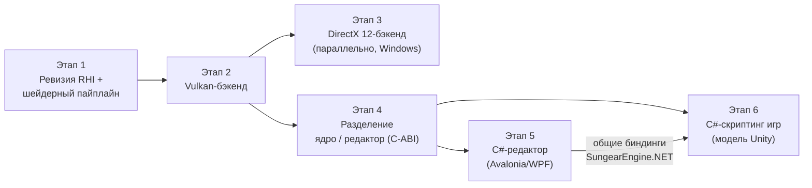

# 📅 IMPLEMENTATION_PLAN — План реализации проекта

## 📋 Оглавление

1. [Обзор проекта](#обзор-проекта)
2. [Текущий статус](#текущий-статус)
3. [Дорожная карта](#дорожная-карта)
4. [План работ по этапам](#план-работ-по-этапам)
5. [Открытые вопросы](#открытые-вопросы)
6. [Риски и зависимости](#риски-и-зависимости)
7. [Метрики успеха](#метрики-успеха)

> ⚠️ Раздел «Текущий статус» сверен с репозиторием на **2026-08-16**.
> Дорожная карта утверждена владельцем проекта 2026-08-16:
> **(1)** поддержка Vulkan и DirectX → **(2)** разделение ядра и редактора
> с явной границей API → **(3)** редактор на C# (XAML/MVVM) →
> **(4)** дальняя цель — C#-скриптинг игр по модели Unity.
> Документ живой — обновляется по мере выполнения задач.

---

## 🎯 Обзор проекта

### Цель проекта

**Sungear Engine** — open-source (Apache-2.0, до v0.14.0.8 — GPL-3.0)
кроссплатформенный игровой движок
на C++23, разрабатываемый командой Pixelfield. Текущая версия — **0.14.0.8**.

Стратегическое направление: уход от OpenGL как основного API к **Vulkan и
DirectX** (путь, пройденный Frostbite/Unity), и разделение движка на **ядро**
и **редактор** с явной границей обращения к ядру (по модели Unity:
нативное ядро + управляемый редактор через explicit-интероп).

### Ключевые компоненты

| Компонент | Технология | Статус | Где |
|-----------|------------|--------|-----|
| Ядро SGCore | C++23, EnTT | 🟡 Активная разработка | `Sources/SGCore/` |
| Графическая абстракция | `Graphics/API` (`IRenderer`, `GAPIType`) | ✅ Есть, скроена под GL | `Sources/SGCore/Graphics/API/` |
| OpenGL-бэкенды | GL4 / GL46 / GLES | ✅ Рабочие | `Graphics/API/GL/` |
| Vulkan-бэкенд | скелет 2023 г., без зависимости vulkan | 🔴 Заглушки | `Graphics/API/Vulkan/` |
| DirectX-бэкенд | — | ❌ Отсутствует | — |
| Редактор v1 / v2 | C++-плагины, ImGui | 🟡 В разработке | `Plugins/` |
| Редактор на C# | .NET, Avalonia/WPF (вопрос №3) | ⬜ Запланирован (этап 5) | — |
| C#-скриптинг игр | CoreCLR-хостинг, модель Unity | ⬜ Дальняя цель (этап 6) | — |
| Android-порт | GLES 3.2, NDK | ⚠️ Частично (без ввода) | `Sources/AndroidApp/` |
| Тесты | `Tests/Coro` | 🔴 Минимальные | `Tests/` |
| CI | — | ❌ Нет | — |

---

## 📊 Текущий статус

### Что уже есть для этапа рендера (✅ сверено с кодом)

- [x] Абстракция графического API: интерфейсы `IRenderer`, `IShader`,
  `ITexture2D`, `IFrameBuffer`, `IVertexArray`, `IUniformBuffer` и др.
  (`Graphics/API/*.h`); рендер-код движка ходит через них, а не в GL напрямую
- [x] Перечисление бэкендов `GAPIType`: GL4, GL46, GLES2, GLES3, VULKAN
  (DirectX-значений нет)
- [x] Каталог `Graphics/API/Vulkan/` — `VkRenderer`, `VkShader`, `VkTexture2D`
  и др.: **скелет без реализации**, `vulkan.h` закомментирован, зависимости
  в `vcpkg.json` нет
- [x] Окно/контекст: GLFW (умеет и GL-контекст, и Vulkan-сюрфейсы);
  в `Main/Window.cpp` ветка под `SG_API_TYPE_VULKAN` уже существует

### Известные пробелы инфраструктуры (⬜ фиксируются, закрываются попутно)

- [ ] CI-пайплайн сборки — сейчас проверка на авторе PR
- [ ] GTest заявлен в `vcpkg.json`, но не подключён в тестах
- [ ] `.clang-format` под CodingConvention.md отсутствует
- [ ] `copy_sgcore_dlls()` закомментирована — ручное копирование DLL
- [ ] README расходится с фактическими именами CMake-пресетов

---

## 🗺️ Дорожная карта

Порядок обоснован так:

1. **Сначала ревизия абстракции, потом бэкенды.** Текущий интерфейс скроен под
   OpenGL: `IVertexArray` — это VAO (концепция GL), `RenderState` — глобальное
   стейт-машинное состояние, юниформы сеттятся поимённо. У Vulkan/DX12 модель
   другая: command buffers, PSO (pipeline state objects), дескрипторы, явная
   синхронизация. Писать Vulkan-бэкенд под GL-образный интерфейс — значит
   переписывать его второй раз.
2. **Vulkan раньше DirectX.** Vulkan кроссплатформенный (Windows, Linux,
   Android — закрывает три наши платформы) и уже начат в коде. DX12
   концептуально близок к Vulkan — после первого «современного» бэкенда второй
   дешевле. При кроссплатформенном C#-редакторе (вьюпорт на Vulkan) DX12
   выходит из критического пути редактора и может идти параллельно этапам 4–5.
3. **Разделение ядра/редактора — после стабилизации рендера.** Граница API
   ядра должна фиксироваться, когда рендер-подсистема перестанет перетряхиваться.
4. **C-ABI граница капитализируется дважды.** Один и тот же слой
   `extern "C"` + C#-биндинги (`SungearEngine.NET`) обслуживает и редактор
   (C# *вызывает* ядро через P/Invoke), и — дальняя цель — скриптинг игр по
   модели Unity (ядро *хостит* CoreCLR и вызывает игровые сборки). Направление
   вызовов противоположное, фундамент общий.
5. **Ядро остаётся кроссплатформенным**, и выбор UI/скриптинга на C# этого не
   ломает: .NET работает на Windows/Linux/macOS, вьюпорт редактора — на
   Vulkan. Windows-only привязка возникла бы только от WPF
   (см. [открытый вопрос №3](#открытые-вопросы)).

---

## 🗓️ План работ по этапам

### Этап 1: Ревизия RHI и шейдерный пайплайн

**Цель**: интерфейс `Graphics/API`, под который можно честно реализовать
Vulkan и DX12, не ломая существующие GL-бэкенды; единый путь компиляции
шейдеров.

| Задача | Роль | Объём | Статус |
|--------|------|-------|--------|
| 1.1 Аудит `Graphics/API`: перечень GL-измов (VAO, глобальный RenderState, поимённые юниформы) и мест, где рендер-код обходит абстракцию → [RHI_AUDIT.md](./RHI_AUDIT.md) | @Senior Graphics Engineer | M | ✅ 2026-08-16 |
| 1.2 Спроектировать целевой RHI: command lists, PSO, дескрипторы/binding model, явные барьеры → [RHI_DESIGN.md](./RHI_DESIGN.md) | @Senior Graphics Engineer | L | 🟡 на утверждении |
| 1.3 Расширить `GAPIType` (`SG_API_TYPE_VULKAN`, `SG_API_TYPE_DX12`) и выбор бэкенда в `Main/Window`/`CoreMain` | @Senior C++ Engine Developer | S | ⬜ |
| 1.4 Шейдерный пайплайн: свой GLSL-add-on → SPIR-V (shaderc/glslang), рефлексия (SPIRV-Reflect/Cross); решение по трансляции в DXIL для DX12 | @Senior Graphics Engineer | L | ⬜ |
| 1.5 Мигрировать GL46-бэкенд на новый RHI (эталонная реализация, ничего не должно visually сломаться) | @Senior Graphics Engineer | L | ⬜ |
| 1.6 Тестовая сцена-«смоук» в `Tests/` для сравнения бэкендов (один кадр, все фичи: PBR, тени, прозрачность) | @Senior C++ Engine Developer | M | ⬜ |

**Критерии готовности**:
- [ ] Документ RHI в SYSTEM_DESIGN утверждён командой
- [ ] GL46 работает через новый RHI, тестовая сцена рендерится идентично (эталонные скриншоты)
- [ ] Шейдеры из `Resources/` компилируются в SPIR-V офлайн или на старте

---

### Этап 2: Vulkan-бэкенд

**Цель**: рабочий Vulkan-бэкенд на Windows и Linux; Android — как расширение.

| Задача | Роль | Объём | Статус |
|--------|------|-------|--------|
| 2.1 Зависимости в `vcpkg.json`: `vulkan`, `vulkan-memory-allocator`, `volk` (или loader напрямую) + обновление INSTALL.md (Vulkan SDK) | @Build Engineer | S | ⬜ |
| 2.2 Инициализация: instance, device, свопчейн через GLFW (`glfwCreateWindowSurface`), кадровый цикл с синхронизацией | @Senior Graphics Engineer | L | ⬜ |
| 2.3 Ресурсы: буферы/текстуры через VMA, реализация RHI-интерфейсов (замена скелета `Graphics/API/Vulkan/` 2023 г.) | @Senior Graphics Engineer | L | ⬜ |
| 2.4 PSO-кэш, дескрипторы, рендер-пассы под PBRRP (полный проход пайплайна: PBR, CSM, постпроцессинг) | @Senior Graphics Engineer | L | ⬜ |
| 2.5 Валидация: запуск со слоями Vulkan validation в Debug (`SUNGEAR_DEBUG`) | @Senior Graphics Engineer | S | ⬜ |
| 2.6 Смоук-сцена из 1.6 на Vulkan = эталону GL46 | @Senior Graphics Engineer | M | ⬜ |
| 2.7 (Расширение) Android: свопчейн без GLFW, проверка на устройстве | @Senior C++ Engine Developer | L | ⬜ |

**Критерии готовности**:
- [ ] Смоук-сцена и `SGEntry` работают на Vulkan на Windows и Linux
- [ ] Debug-сборка чиста от ошибок validation layers на смоук-сцене
- [ ] Выбор бэкенда GL/Vulkan — конфигурацией, без пересборки

---

### Этап 3: DirectX 12-бэкенд (Windows)

**Цель**: DX12-бэкенд, повторяющий функциональность Vulkan-бэкенда; основа
для интеропа с WPF-редактором (этап 5).

| Задача | Роль | Объём | Статус |
|--------|------|-------|--------|
| 3.1 Инфраструктура: Agility SDK/заголовки, DXC для шейдеров, ветка `SG_TARGET_OS_WINDOWS` в CMake | @Build Engineer | M | ⬜ |
| 3.2 Инициализация: device, command queues, свопчейн (HWND из GLFW через `glfwGetWin32Window`) | @Senior Graphics Engineer | L | ⬜ |
| 3.3 Ресурсы и PSO поверх RHI (маппинг концепций 1:1 с Vulkan-бэкендом) | @Senior Graphics Engineer | L | ⬜ |
| 3.4 Шейдеры: SPIR-V → DXIL (spirv-cross → HLSL → DXC, либо прямой путь по решению из 1.4) | @Senior Graphics Engineer | M | ⬜ |
| 3.5 Смоук-сцена на DX12 = эталону | @Senior Graphics Engineer | M | ⬜ |

**Критерии готовности**:
- [ ] Смоук-сцена и `SGEntry` работают на DX12
- [ ] Один и тот же исходник шейдера собирается под GL, Vulkan и DX12 без ручного дублирования

---

### Этап 4: Разделение ядра и редактора

**Цель**: явная граница «ядро ↔ редактор» по модели Unity — редактор
обращается к ядру только через зафиксированный explicit-интерфейс, а не
линкуется со всем C++-API движка.

| Задача | Роль | Объём | Статус |
|--------|------|-------|--------|
| 4.1 Спроектировать границу: перечень операций редактора над ядром (сцены, сущности/компоненты, ассеты, рендер-вьюпорт, play mode) | @Senior C++ Engine Developer | M | ⬜ |
| 4.2 C-ABI слой поверх SGCore (`extern "C"`, стабильные хендлы вместо C++-типов) — основа для P/Invoke из .NET | @Senior C++ Engine Developer | L | ⬜ |
| 4.3 Рендер-вьюпорт как сервис ядра: рендер сцены в offscreen-текстуру/shared surface по запросу внешнего хоста | @Senior Graphics Engineer | L | ⬜ |
| 4.4 Решение о судьбе редакторов v1/v2 (C++/ImGui): заморозка, доработка как fallback для Linux или удаление | владелец проекта | — | ⬜ |
| 4.5 Обновить SYSTEM_DESIGN и PROJECT_STRUCTURE под новую границу | @Tech Writer | S | ⬜ |

**Критерии готовности**:
- [ ] Ядро собирается и работает без единого упоминания редактора
- [ ] Все операции редактора проходят через C-ABI слой (проверяемо: редактор не инклудит заголовки SGCore, кроме публичного C-API)
- [ ] Тест на C-API: создание сцены, сущности, компонента, сохранение — из внешнего процесса

---

### Этап 5: Редактор на C# (XAML/MVVM)

**Цель**: UI редактора на C# (.NET), ядро — нативный движок за C-ABI из
этапа 4, вьюпорт движка встроен в окно редактора. UI-фреймворк — Avalonia
(рекомендация: тот же XAML/MVVM-стек, что WPF, но кроссплатформенный —
редактор работает везде, где работает ядро) либо WPF, если примем
Windows-only (открытый вопрос №3, решить до старта этапа).

| Задача | Роль | Объём | Статус |
|--------|------|-------|--------|
| 5.1 **`SungearEngine.NET`** — слой C#-биндингов: P/Invoke к C-API, safe-обёртки, хендлы, математика. Отдельная сборка **без зависимостей от UI** — она же фундамент этапа 6 | @Tools Developer | L | ⬜ |
| 5.2 Каркас редактора: Avalonia-приложение, docking-панели, MVVM | @Tools Developer | M | ⬜ |
| 5.3 Вьюпорт, шаг 1: `NativeControlHost` — редактор отдаёт ядру нативный хендл области окна (HWND/X11/NSView), ядро создаёт там Vulkan-свопчейн | @Tools Developer + @Senior Graphics Engineer | L | ⬜ |
| 5.4 Вьюпорт, шаг 2 (опционально): шаринг offscreen-текстуры через Vulkan external memory в композитор UI (UI поверх вьюпорта, несколько вьюпортов) | @Senior Graphics Engineer | L | ⬜ |
| 5.5 Базовые панели: иерархия сцены, инспектор компонентов, браузер ассетов, лог | @Tools Developer | L | ⬜ |
| 5.6 Play mode: запуск/остановка симуляции через C-API, изоляция состояния | @Tools Developer | M | ⬜ |
| 5.7 Стиль C#/XAML — завести скилл `dotnet-xaml-style` (см. SKILLS.md) | @Tools Developer | S | ⬜ |

**Критерии готовности**:
- [ ] Редактор открывает сцену движка, показывает вьюпорт с рендером ядра
- [ ] Изменение компонента в инспекторе видно во вьюпорте без перезапуска
- [ ] Редактор не линкуется с C++-API движка напрямую (только C-ABI через `SungearEngine.NET`)
- [ ] При выборе Avalonia: редактор запускается на Windows и Linux

---

### Этап 6: C#-скриптинг игр (модель Unity) — дальняя цель

**Цель**: игровая логика пишется на C#, как в Unity: ядро хостит .NET-рантайм
и вызывает игровые сборки; C#-скрипт — это компонент на сущности ECS.
Этап стартует после стабилизации C-ABI (этап 4) и биндингов (задача 5.1).

| Задача | Роль | Объём | Статус |
|--------|------|-------|--------|
| 6.1 Хостинг CoreCLR в ядре (`hostfxr`/`nethost`): загрузка рантайма, поиск и загрузка игровых сборок | @Senior C++ Engine Developer | L | ⬜ |
| 6.2 Managed-API поверх `SungearEngine.NET`: жизненный цикл скрипта (аналоги Awake/Update/FixedUpdate), доступ к сущностям, компонентам, вводу, ассетам | @Tools Developer | L | ⬜ |
| 6.3 C#-скрипт как ECS-компонент: регистрация, привязка к сущности, порядок вызовов относительно нативных систем | @Senior C++ Engine Developer | L | ⬜ |
| 6.4 Интероп-дисциплина: батчинг вызовов через границу (никаких «болтливых» per-frame P/Invoke на каждую сущность), блиттабельные структуры | @Senior C++ Engine Developer | M | ⬜ |
| 6.5 Hot reload сборок в редакторе (`AssemblyLoadContext`), пересоздание состояния скриптов | @Tools Developer | L | ⬜ |
| 6.6 Serde: сериализация публичных полей C#-скриптов в сцену (интеграция с MetaInfo/Serde ядра) | @Senior C++ Engine Developer | L | ⬜ |
| 6.7 Шаблон C#-проекта игры + интеграция в сборку/редактор | @Tools Developer | M | ⬜ |

**Критерии готовности**:
- [ ] Сцена с C#-скриптом на сущности работает в `SGEntry` без редактора
- [ ] Правка скрипта → hot reload в редакторе без перезапуска
- [ ] Поля скрипта видны в инспекторе и сериализуются в сцену
- [ ] Замер: оверхед интеропа на N сущностей со скриптами зафиксирован в тесте

---

## ❓ Открытые вопросы

Требуют решения владельца проекта; без них соответствующие задачи не стартуют.

| # | Вопрос | Влияет на | Рекомендация |
|---|--------|-----------|--------------|
| 1 | DX12 или DX11? | Этап 3 | **DX12**: концептуально совпадает с Vulkan (общий RHI дешевле), DX11 — ещё одна стейт-машина рядом с GL |
| 2 | ~~Судьба OpenGL-бэкендов после Vulkan~~ | Этапы 1–2, объём поддержки | ✅ **Решено 2026-08-16: OpenGL остаётся постоянным fallback-бэкендом** для обратной совместимости (по модели Unigine/Unity). GL46 — полноправная реализация нового RHI, а не временный мост; GLES — fallback на Android до и после Vulkan. Следствие: смоук-сцена (1.6) гоняется на GL при каждом изменении RHI, GL не имеет права отставать по фичам |
| 3 | UI-фреймворк редактора: Avalonia (кроссплатформенно, вьюпорт на Vulkan) или WPF (Windows-only, знакомый стек)? | Этап 5, судьба Linux-редактора | **Avalonia**: тот же XAML/MVVM, но редактор сохраняет кроссплатформенность ядра; при WPF Linux остаётся без редактора |
| 4 | Судьба редакторов v1/v2 (C++/ImGui) | Этап 4 | Заморозить после старта C#-редактора, не развивать три редактора параллельно |
| 5 | Шейдерный исходник: остаёмся на своём GLSL-add-on или переход на HLSL как первоисточник? | Этапы 1.4, 3.4 | Остаться на GLSL-add-on → SPIR-V → (spirv-cross) HLSL/DXIL: сохраняет существующие шейдеры в `Resources/` |
| 6 | ~~Лицензия и «сторона Unity»: GPL-3.0 обязывает игры быть GPL~~ | Этап 6 | ✅ **Решено 2026-08-16: переход на Apache-2.0** (пермиссивная + явная патентная защита; закрытые коммерческие игры разрешены). `LICENSE` и `NOTICE` заменены; релизы ≤ 0.14.0.8 остаются под GPL-3.0. ⚠️ До мержа в апстрим — получить явное согласие всех четырёх правообладателей (pfhgil, 8bitniksis, MisterChoose, CREAsTIVE), напр. комментариями в issue |

---

## ⚠️ Риски и зависимости

### Технические риски

| Риск | Вероятность | Влияние | Митигация |
|------|-------------|---------|-----------|
| RHI-ревизия (1.2/1.5) затянется: рендер-код местами может обходить абстракцию | Средняя | Высокое | Аудит 1.1 до проектирования; GL46 мигрируется первым как эталон |
| Vulkan-скелет 2023 г. создаёт иллюзию задела | Высокая | Низкое | Считать `Graphics/API/Vulkan/` черновиком под замену, не достраивать его |
| Шейдерная трансляция GLSL-add-on → SPIR-V → DXIL даст расхождения между бэкендами | Средняя | Высокое | Смоук-сцена с эталонными скриншотами на каждый бэкенд (1.6); расхождение = баг |
| Вьюпорт в C#-UI: интероп «движок → окно редактора» нетривиален | Средняя | Среднее | Двухшаговый план (5.3/5.4): сначала `NativeControlHost` + свопчейн ядра (просто), шаринг текстуры — потом |
| C-ABI граница (4.2) окажется дырявой: редактору «срочно» нужен прямой доступ | Высокая | Высокое | Правило: нужен новый доступ — расширяется C-API, прямые инклуды ядра в редакторе запрещены (критерий этапа 4) |
| Скриптинг (этап 6): «болтливый» интероп и паузы GC уронят частоту кадров | Высокая | Высокое | Задача 6.4 — батчинг и блиттабельные структуры с самого начала; замер оверхеда — критерий готовности этапа |
| Параллельная разработка: рендер перетряхивается, а редактор v2 продолжает писаться под старое | Средняя | Среднее | Решение по 4.4 принять не позже конца этапа 2 |

### Зависимости

| Зависимость | От чего | Статус |
|-------------|---------|--------|
| Vulkan SDK / validation layers | этап 2, машины разработчиков | ⬜ добавить в INSTALL.md при старте этапа |
| vcpkg: `vulkan`, `vulkan-memory-allocator`, DXC | этапы 2–3 | ⬜ через `vcpkg.json`, по правилам DEV_RULES |
| .NET SDK (редактор, биндинги, позже скриптинг) | этапы 5–6 | ⬜ версия — при старте этапа |
| vcpkg baseline `d5a87c6b`, msdf-atlas-gen v1.3 | воспроизводимость сборки | ✅ Закреплены |
| `SUNGEAR_SOURCES_ROOT` | вся система пресетов и плагинов | ⚠️ Ручная настройка каждого разработчика |

---

## 📈 Метрики успеха

| Метрика | Целевое значение | Текущее | Статус |
|---------|------------------|---------|--------|
| Бэкенды рендера, проходящие смоук-сцену | GL46, Vulkan, DX12 | GL46 (без смоук-сцены) | ⬜ |
| Один исходник шейдера → все бэкенды | да | GLSL-only | ⬜ |
| Ядро без ссылок на редактор, редактор только через C-ABI | да | редактор = C++-плагин с полным доступом | ⬜ |
| Вьюпорт движка в окне C#-редактора | да | — | ⬜ |
| Сцена с C#-скриптом работает в рантайме без редактора | да | скриптинг только Lua (sol2) | ⬜ |
| Сборка из чистого клона по INSTALL.md | да | проверить на новичке | ⬜ |
| PR собирается CI до ревью | да | CI нет | ⬜ |

---

## 🔗 Ссылки на документы

| Документ | Описание | Ссылка |
|----------|----------|--------|
| PROJECT_STRUCTURE | Устройство проекта | [📄](./PROJECT_STRUCTURE.md) |
| SYSTEM_DESIGN | Архитектура движка | [📄](./SYSTEM_DESIGN.md) |
| USER_RULES | Правила работы с ИИ | [📄](./USER_RULES.md) |
| DEV_RULES | Стандарты разработки | [📄](./DEV_RULES.md) |
| INSTALL | Развёртывание | [📄](./INSTALL.md) |

---

*Документ является живым и должен обновляться по мере выполнения задач*
