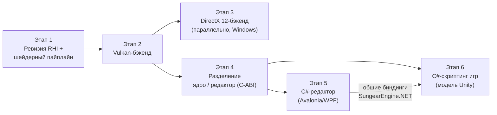

# 📅 IMPLEMENTATION_PLAN — План реализации проекта

## 📋 Оглавление

1. [Обзор проекта](#обзор-проекта)
2. [Текущий статус](#текущий-статус)
3. [Дорожная карта](#дорожная-карта)
4. [План работ по этапам](#план-работ-по-этапам)
5. [Открытые вопросы](#открытые-вопросы)
6. [Риски и зависимости](#риски-и-зависимости)
7. [Метрики успеха](#метрики-успеха)

> ⚠️ Раздел «Текущий статус» сверен с репозиторием на **2026-08-16**.
> Дорожная карта утверждена владельцем проекта 2026-08-16:
> **(1)** поддержка Vulkan и DirectX → **(2)** разделение ядра и редактора
> с явной границей API → **(3)** редактор на C# (XAML/MVVM) →
> **(4)** дальняя цель — C#-скриптинг игр по модели Unity.
> Документ живой — обновляется по мере выполнения задач.

---

## 🎯 Обзор проекта

### Цель проекта

**Sungear Engine** — open-source (Apache-2.0, до v0.14.0.8 — GPL-3.0)
кроссплатформенный игровой движок
на C++23, разрабатываемый командой Pixelfield. Текущая версия — **0.14.0.8**.

Стратегическое направление: уход от OpenGL как основного API к **Vulkan и
DirectX** (путь, пройденный Frostbite/Unity), и разделение движка на **ядро**
и **редактор** с явной границей обращения к ядру (по модели Unity:
нативное ядро + управляемый редактор через explicit-интероп).

### Ключевые компоненты

| Компонент | Технология | Статус | Где |
|-----------|------------|--------|-----|
| Ядро SGCore | C++23, EnTT | 🟡 Активная разработка | `Sources/SGCore/` |
| Графическая абстракция | `Graphics/API` (`IRenderer`, `GAPIType`) | ✅ Есть, скроена под GL | `Sources/SGCore/Graphics/API/` |
| OpenGL-бэкенды | GL4 / GL46 / GLES | ✅ Рабочие | `Graphics/API/GL/` |
| Vulkan-бэкенд | скелет 2023 г., без зависимости vulkan | 🔴 Заглушки | `Graphics/API/Vulkan/` |
| DirectX-бэкенд | — | ❌ Отсутствует | — |
| Редактор v1 / v2 | C++-плагины, ImGui | 🟡 В разработке | `Plugins/` |
| Редактор на C# | .NET, Avalonia/WPF (вопрос №3) | ⬜ Запланирован (этап 5) | — |
| C#-скриптинг игр | CoreCLR-хостинг, модель Unity | ⬜ Дальняя цель (этап 6) | — |
| Android-порт | GLES 3.2, NDK | ⚠️ Частично (без ввода) | `Sources/AndroidApp/` |
| Тесты | `Tests/Coro` | 🔴 Минимальные | `Tests/` |
| CI | — | ❌ Нет | — |

---

## 📊 Текущий статус

### Что уже есть для этапа рендера (✅ сверено с кодом)

- [x] Абстракция графического API: интерфейсы `IRenderer`, `IShader`,
  `ITexture2D`, `IFrameBuffer`, `IVertexArray`, `IUniformBuffer` и др.
  (`Graphics/API/*.h`); рендер-код движка ходит через них, а не в GL напрямую
- [x] Перечисление бэкендов `GAPIType`: GL4, GL46, GLES2, GLES3, VULKAN
  (DirectX-значений нет)
- [x] Каталог `Graphics/API/Vulkan/` — `VkRenderer`, `VkShader`, `VkTexture2D`
  и др.: **скелет без реализации**, `vulkan.h` закомментирован, зависимости
  в `vcpkg.json` нет
- [x] Окно/контекст: GLFW (умеет и GL-контекст, и Vulkan-сюрфейсы);
  в `Main/Window.cpp` ветка под `SG_API_TYPE_VULKAN` уже существует

### Известные пробелы инфраструктуры (⬜ фиксируются, закрываются попутно)

- [ ] CI-пайплайн сборки — сейчас проверка на авторе PR
- [ ] GTest заявлен в `vcpkg.json`, но не подключён в тестах
- [ ] `.clang-format` под CodingConvention.md отсутствует
- [ ] `copy_sgcore_dlls()` закомментирована — ручное копирование DLL
- [ ] README расходится с фактическими именами CMake-пресетов
- [ ] **JDK обязателен для сборки на всех платформах**, хотя JNI используется только под Android: `find_package(JNI REQUIRED)` в корневом CMake и `SungearEngineInclude.cmake`, безусловные `#include <jni.h>` в `ExternalAPI/Java/Main.h` (тянется `Window.h`), `JNIManager.h`, `FileUtils.cpp`; на ПК линкуется `jvm.lib` без надобности. Кандидат: сделать JNI Android-only (S, требует проверки Android-сборки)

---

## 🗺️ Дорожная карта

Порядок обоснован так:

1. **Сначала ревизия абстракции, потом бэкенды.** Текущий интерфейс скроен под
   OpenGL: `IVertexArray` — это VAO (концепция GL), `RenderState` — глобальное
   стейт-машинное состояние, юниформы сеттятся поимённо. У Vulkan/DX12 модель
   другая: command buffers, PSO (pipeline state objects), дескрипторы, явная
   синхронизация. Писать Vulkan-бэкенд под GL-образный интерфейс — значит
   переписывать его второй раз.
2. **Vulkan раньше DirectX.** Vulkan кроссплатформенный (Windows, Linux,
   Android — закрывает три наши платформы) и уже начат в коде. DX12
   концептуально близок к Vulkan — после первого «современного» бэкенда второй
   дешевле. При кроссплатформенном C#-редакторе (вьюпорт на Vulkan) DX12
   выходит из критического пути редактора и может идти параллельно этапам 4–5.
3. **Разделение ядра/редактора — после стабилизации рендера.** Граница API
   ядра должна фиксироваться, когда рендер-подсистема перестанет перетряхиваться.
4. **C-ABI граница капитализируется дважды.** Один и тот же слой
   `extern "C"` + C#-биндинги (`SungearEngine.NET`) обслуживает и редактор
   (C# *вызывает* ядро через P/Invoke), и — дальняя цель — скриптинг игр по
   модели Unity (ядро *хостит* CoreCLR и вызывает игровые сборки). Направление
   вызовов противоположное, фундамент общий.
5. **Ядро остаётся кроссплатформенным**, и выбор UI/скриптинга на C# этого не
   ломает: .NET работает на Windows/Linux/macOS, вьюпорт редактора — на
   Vulkan. Windows-only привязка возникла бы только от WPF
   (см. [открытый вопрос №3](#открытые-вопросы)).

---

## 🗓️ План работ по этапам

### Этап 1: Ревизия RHI и шейдерный пайплайн

**Цель**: интерфейс `Graphics/API`, под который можно честно реализовать
Vulkan и DX12, не ломая существующие GL-бэкенды; единый путь компиляции
шейдеров.

| Задача | Роль | Объём | Статус |
|--------|------|-------|--------|
| 1.1 Аудит `Graphics/API`: перечень GL-измов (VAO, глобальный RenderState, поимённые юниформы) и мест, где рендер-код обходит абстракцию → [RHI_AUDIT.md](./RHI_AUDIT.md) | @Senior Graphics Engineer | M | ✅ 2026-08-16 |
| 1.2 Спроектировать целевой RHI: command lists, PSO, дескрипторы/binding model, явные барьеры → [RHI_DESIGN.md](./RHI_DESIGN.md) | @Senior Graphics Engineer | L | 🟡 на утверждении |
| 1.3 Расширить `GAPIType` (`SG_API_TYPE_DX12`, хелперы `isOpenGLAPI`/`isExplicitAPI`), `GAPISelector` — список предпочтения, `SG_GAPI`, откат по доступности; хардкод в `CoreMain` заменён | @Senior C++ Engine Developer | S | ✅ 2026-08-17: собрано (MSVC 14.51, Debug), проверено запуском `SGSmokeTest --gapi gl4/gl46` — выбор бэкенда работает |
| 1.3a Рантайм-откат с пересозданием окна: если `confirmSupport()`/инициализация бэкенда провалилась после создания окна — уничтожить окно и перейти к следующему кандидату (сейчас GL-бэкенд при провале закрывает окно). Нужен, когда появится Vulkan-инициализация, которая может упасть | @Senior C++ Engine Developer | M | ⬜ (делать в 2.2) |
| 1.4a Проход «вулканизации» SGSL → Vulkan-GLSL: `Utils/SGSL/SGSLEVulkanizer` — 140+ свободных юниформов в один std140-блок (`SGLegacyUniforms`, члены видны под старыми именами — код шейдеров не меняется), авто-`set/binding` для сэмплеров/UBO/TBO с сохранением явных, `#if`-условия членов сохраняются (общий guard файла вырезается), `gl_FragColor`→`out`, `gl_VertexID`→`gl_VertexIndex`; биндинги едины для всех стадий программы. Тест `Tests/Shaders` (`SGShadersTest`): юнит-снипеты + прогон корпуса с дампом | @Senior Graphics Engineer | M | ✅ 2026-08-17: собрано; юнит PASS; корпус 24 файла / 50 стадий / 529 юниформов перенесено / 169 сэмплеров + 92 UBO забиндены, предупреждения только про макро-размеры массивов |
| 1.4b Компиляция в SPIR-V (glslang 15.1, target Vulkan 1.3 / SPIR-V 1.6) + рефлексия (SPIRV-Reflect) → `Graphics/SPIRV/{SPIRVCompiler, ShaderReflection}`: все стадии программы линкуются вместе (авто-локации in/out), рефлексия — объединение по стадиям (биндинги с масками стадий, члены блоков с offset/size, вершинные входы, push constants). Зависимости добавлены в `vcpkg.json` (согласовано 2026-08-17). Кеш по хешу и DXIL для DX12 — в 1.5/этап 3 | @Senior Graphics Engineer | L | ✅ 2026-08-17: **23/23 программ корпуса компилируются в SPIR-V без ошибок**; юнит-тест рефлексии (std140-offsets, массивы, маски стадий) PASS |
| 1.4d Пер-стадийные legacy-блоки: `SGLegacyUniforms_<stage>` с экземпляром `sg_<block>`, обращения переписаны в `instance.member`. Причина: стадия видит только свои типы (`screen.glsl` инклудит `uniform_bufs_decl.glsl` только в вершинной), а члены анонимных блоков живут в глобальном пространстве имён программы — glslang не линкует. Следствие для фасада: `useX("имя")` пишет во **все** блоки, где есть член | @Senior Graphics Engineer | — | ✅ решено в ходе 1.4b |
| 1.4c Найдено при прогоне: `features/pbr/instancing.sgshader` инклудит несуществующий `impl/glsl4/pbr/instancing.glsl` — мёртвый шейдер (0 стадий). Удалить или восстановить файл | @Senior Graphics Engineer | S | ⬜ вопрос к Ilya |
| 1.4e Три пред-существующие `[error]`-строки в логе любого запуска на `BasicApp` (не связаны с RHI): `SungearEngineConfig.json` не найден; **`no_material.sgmat`: Serde не находит член `m_useDataSerde` (схема `IMaterial` разошлась с ресурсом — материал грузится с дефолтами)**; ключ `enginePath` запрашивается до `CoreMain::init`. Первая и третья — косметика, вторая — реальный баг для Ilya | @Senior C++ Engine Developer | S | ⬜ вопрос к Ilya |
| 1.5a Каркас RHI в коде (`Graphics/RHI/`): `IDevice`, `ICommandList`, `ISwapchain`, `IGPUBuffer`, `IShaderProgram` (+`ShaderReflection`), `IPipelineState`/`PipelineStateDesc` (поверх существующих `RenderState`/`BlendingState`/`MeshRenderState`, хеш для кеша), `IDescriptorSet`, `RHITypes` (`DeviceProperties`, `VertexInputDesc`, `RenderPassBeginDesc`…). `IRenderer::getDevice()` | @Senior Graphics Engineer | M | ✅ 2026-08-17 |
| 1.5b GL46-реализация RHI (`GL/GL46/RHI/`): immediate-mode `GL46CommandList`, `GL46Device` с кешем PSO, `GL46PipelineState` (VAO из `VertexInputDesc` через DSA, буферы биндятся per-draw), `GL46GPUBuffer` (immutable storage, map/write), `GL46ShaderProgram` (GLSL из вулканизатора в OPENGL-диалекте, **рефлексия через program interface query** — источник истины для GL), `GL46DescriptorSet` (glBindBufferBase/glBindTextureUnit), `GL46Swapchain`. Вулканизатор получил `Target::OPENGL` (без `set=`, `gl_VertexID` сохраняется) — **один шейдерный путь для GL46 и Vulkan** | @Senior Graphics Engineer | L | ✅ 2026-08-17: `Tests/RHI` (`SGRHITest`) — треугольник через RHI в IFrameBuffer, UBO по рефлексии, readback: центр (0,127,0), угол = clear — PASS |
| 1.5c Миграция проходов на RHI под смоук-контролем. **Шаг 6 — текстуры: решение зафиксировано 2026-08-17** — юнит-модель проходов (22 места) не переписывается; для explicit-бэкендов её транслирует фасад с таблицей юнитов → `IDescriptorSet` по рефлексии (см. RHI_DESIGN «Состояние реализации»), делается вместе с Vulkan-устройством в 2.3. **Итог 1.5c на GL46: шейдеры, буферы, PSO, все 17 draw-точек, render targets, вывод на экран — через RHI; проходы не менялись; смоук 0 %.** **Шаг 5 — фреймбуферы ✅ 2026-08-17**: `GL46FrameBuffer` (оживлён пустой legacy-класс) исполняет `bind`/`bindAttachmentsToDrawIn`/`clear`/`clearAttachment`/`unbind` как RHI render pass — `ICommandList::beginRenderPass` (хендл FBO через `IFrameBuffer::getNativeHandle()`, draw buffers, viewport по правилам legacy) / новые `clearColorAttachment`/`clearDepthStencil` (аналог `vkCmdClearAttachments`) / `endRenderPass` (восстанавливает viewport окна как legacy `unbind`); смена draw buffers под биндом = перезапуск прохода с LOAD (форма, нужная Vulkan). 14 пар bind/unbind в 16 файлах проходов не тронуты; смоук 0 %. **Шаг 4 — legacy vertex arrays ✅ 2026-08-17**: `renderArray`/`renderArrayInstanced` (7 точек: батчинг, декали, инстансинг, дебаг-линии, текст, UI, тени) на GL46 идут через RHI: буферы `IVertexArray` оборачиваются не владеющими `GL46GPUBuffer` (по `getNativeHandle()`, кеш по хендлу — динамические буферы обновляются на месте), PSO из записанных атрибутов (слот на буфер, `perInstance` по divisor) + программа привязанного шейдера; смоук 0 %. **Все 17 точек отрисовки на GL46 теперь проходят через `ICommandList`.** **Шаг 3 — меши ✅ 2026-08-17**: `GL46Renderer::renderMeshData` (10 из 17 точек отрисовки во всех проходах) идёт через RHI: `IMeshData::m_rhi` — ленивое зеркало меша (`IGPUBuffer` вершин/цветов/индексов, `VertexInputDesc` из записанных `IVertexBuffer::getAttributes()`), PSO = программа текущего legacy-шейдера (`GL46LegacyProgram` поверх `GL46ProgramBase`) + кешированные состояния + раскладка меша, draw через `ICommandList`; откат на legacy VAO, если шейдер не привязан. 6 PSO на сцену смоука, 0 % расхождений. **Шаг 2 — шейдерный объект ✅ 2026-08-17**: `GL46Shader` в режиме `m_useRHIUniforms` (включает `GL46Renderer::createShader`) компилирует **вулканизированный** GLSL (OPENGL-диалект, биндинги с 8 — точки 1–4 заняты legacy-`IUniformBuffer`), рефлектит программу и маршрутизирует `useX("имя")` в UBO-блоки `SGLegacyUniforms_<stage>` по offset/stride (`name[i]` поддержан, запись во все блоки стадий); сэмплеры — как раньше через glUniform; инициализаторы (`pxRange = 6.0`) вычисляются из `Report::m_defaults`. **Все 23 программы движка теперь работают по Vulkan-модели данных без изменения проходов; смоук gl46 — 0 %.** **Шаг 1 — screen quad ✅ 2026-08-17**: `RHIShaderLoader` (`.sgshader` → транслятор → вулканизатор под диалект устройства → `IShaderProgram`; для explicit API — ещё и SPIR-V) и `ScreenBlit` (RHI-проход вывода текстуры на экран); `GL46Renderer::renderTextureOnScreen` идёт через него с откатом на legacy; `IRenderer::readScreenPixels()` для проверки. `SGRHITest` — экран = текстура байт в байт; `SGSmokeTest --gapi gl46` — PASS 0 %. Далее по порядку RHI_DESIGN: PBRRP geometry → CSM → PostProcess → остальные; `IShader` → `IShaderProgram`; push constants на GL через мини-UBO; удаление фасада | @Senior Graphics Engineer | L | 🟡 в работе (1 из ~16 проходов) |
| 1.6 Тестовая сцена-«смоук» `Tests/Smoke` (`SGSmokeTest`): PBR-тела, атмосфера, стохастическая прозрачность, SSAO; захват кадра в PNG, сравнение с эталоном (`--reference`, порог/доля), `--gapi`. Для захвата добавлен `IFrameBuffer::readAttachmentPixels()` (GL, в родном формате attachment'а) | @Senior C++ Engine Developer | M | ✅ 2026-08-17: собрано и запущено. GL4 детерминирован (повтор — 0 % расхождений). Эталон `Tests/Smoke/references/smoke_gl4_1920x1080.png` |
| 1.6a Тени в смоук-сцене: `SunShadowsPass` рендерит в каскады только `Batch`-сущности (`view<Batch, ShadowCaster>`), обычные меши теней не отбрасывают. Нужен ответ Ilya: правильный путь — вставка мешей в `Batch` с удалением `EnableMeshPass`, или тени для обычных мешей планируются отдельно | @Senior Graphics Engineer | S | ⬜ вопрос к Ilya |
| 1.6b `GL46Renderer` был сломан (чёрный кадр, `GL_INVALID_ENUM`). Причины: `createShader()` не добавлял дефайн `SG_GLSL4` (весь код шейдеров под `#if` исчезал — отсюда «No input primitive type» и чёрный кадр) и заглушка `GL46Texture2D` 2023 г. (`GL_GENERATE_MIPMAP` через DSA, захардкоженный тип данных). **Решение 2026-08-17: GL46 — основной GL-бэкенд**; `GL46Renderer` = GL4-реализация на контексте 4.6 с `#version 460 core`, `GL46Texture2D` удалён (наследуется рабочий `GL4Texture2D`), DSA возвращается пообъектно при миграции на RHI. `GAPISelector`: GL46 перед GL4 | @Senior Graphics Engineer | M | ✅ 2026-08-17: смоук на `--gapi gl46` — PASS, попиксельно = GL4 (эталон `smoke_gl_1920x1080.png` общий) |

**Критерии готовности**:
- [ ] Документ RHI в SYSTEM_DESIGN утверждён командой
- [ ] GL46 работает через новый RHI, тестовая сцена рендерится идентично (эталонные скриншоты)
- [ ] Шейдеры из `Resources/` компилируются в SPIR-V офлайн или на старте

---

### Этап 2: Vulkan-бэкенд

**Цель**: рабочий Vulkan-бэкенд на Windows и Linux; Android — как расширение.

| Задача | Роль | Объём | Статус |
|--------|------|-------|--------|
| 2.1 Зависимости в `vcpkg.json`: `vulkan-headers`, `vulkan-loader` (не Android), `vulkan-memory-allocator` (baseline d5a87c6b: 1.4.309.0 / 3.3.0; volk не нужен — loader линкуется напрямую, `Vulkan::Loader`); подключены в корневом CMake, `SGCore/CMakeLists.txt` и `SungearEngineInclude.cmake` (плагины); INSTALL.md — Vulkan SDK (ради validation layers), RenderDoc | @Build Engineer | S | ✅ 2026-08-17 |
| 2.2 Инициализация: `RHI/VulkanContext` (instance 1.3 + `VK_LAYER_KHRONOS_validation` в Debug + debug utils, surface через `glfwCreateWindowSurface`, выбор GPU с graphics+present, device с dynamicRendering/synchronization2/`VK_EXT_depth_clip_control`, VMA), `RHI/VulkanSwapchain` (FIFO, ленивый acquire, present через `Window::swapBuffers`, 2 кадра в полёте), `VkRenderer::init/confirmSupport/prepareFrame`, `IRenderer::shutdown()` в конце цикла. **`SGRHITest --gapi vulkan` — PASS, код возврата 0**: readback attachment'а и экрана совпадают с GL46 байт в байт, ноль ошибок validation. Попутно вычищен порядок завершения процесса (падало `abort()` уже после PASS, в статической деструкции): `IRenderer::shutdown()` + реестр живых GPU-ресурсов в `VulkanContext`, `VkRenderer::getLiveDevice()` для фасадов вместо `getInstance()`, `AudioDevice::shutdown()`, `FontsManager` чистит шрифты до `deinitializeFreetype`. Регрессий на GL46 нет: `SGRHITest --gapi gl46` PASS, смоук 0.000 % | @Senior Graphics Engineer | L | ✅ 2026-08-17 |
| 2.3 Ресурсы: RHI на Vulkan **сделан** (`RHI/`: `VulkanDevice`, `VulkanGPUBuffer` (VMA), `VulkanTexture`, `VulkanShaderProgram` (SPIR-V + layout'ы по рефлексии), `VulkanPipelineState` (варианты по форматам прохода), `VulkanDescriptorSet` (транзиентные наборы), `VulkanCommandList` (dynamic rendering, transfer-буфер для аплоадов в проходе)); фасады `VkTexture2D` и `VkFrameBuffer` (render pass из bind/unbind, readback) — **сделаны**. **`VkShader` ✅ 2026-08-17**: компилирует все шейдеры движка на Vulkan (SGSL → вулканизатор `Target::VULKAN` → SPIR-V), UBO на каждый `SGLegacyUniforms_<stage>` (host-visible, запись по offset/stride из рефлексии, `name[i]` поддержан, дефолты из `Report::m_defaults`), **таблица юнитов** — `RHI/VulkanTextureUnits` (`bind(U)` → «юнит U = текстура») + `m_samplerUnits` (`useTextureBlock(name, U)` → «сэмплер name читает юнит U»), соединяются в `IDescriptorSet` по рефлексии в `buildDescriptorSet()`; `VkFrameBuffer::bindAttachment` делегирует в текстуру, как GL4. Попутно исправлены два дефекта: (1) `m_paddedSize` в SPIR-V-рефлексии — это должен быть страйд элемента массива (`array.stride`), а не размер всего члена (иначе `name[i]` пишет за пределы блока: 280 ошибок на смоуке); (2) аплоад текстуры сайзился по CPU-каналам, а копия — по VkFormat (невалидный `vkCmdCopyBufferToImage`; теперь `formatTexelSize` + отказ с диагностикой). Смоук на Vulkan доходит до рендер-проходов, **ноль ошибок validation**. **`VkUniformBuffer` ✅ 2026-08-17**: host-visible RHI-буфер + реестр `RHI/VulkanSharedUniformBuffers` по имени блока (общие UBO движка объявлены без явного `binding`, поэтому `setLayoutLocation` на Vulkan не значит ничего); создание общих UBO и `prepareUniformBuffers` перенесены из `GL4Renderer` в `IRenderer` — это данные движка, а не GL (GL46/GL4 после переноса: смоук 0.000 %). **Смоук на Vulkan отрабатывает сцену целиком: 60 кадров, exit 0, ноль ошибок validation — но кадр чёрный**, потому что геометрия ещё не отправляется. **Геометрия ✅ 2026-08-17 (частично)**: `VkVertexBuffer`/`VkIndexBuffer` над `VulkanGPUBuffer` (host-visible для динамических, device-local для статических), `VkRenderer::renderMeshData` строит PSO из программы привязанного `VkShader` + кешированных состояний + `IMeshData::m_rhi` и пишет **в командный список открытого прохода** (на Vulkan проход = один командный буфер), `useState`/`useBlendingState`/`useMeshRenderState` теперь запоминают состояние. Удалён `VkMeshData` — его заглушка переопределяла `IMeshData::prepare()` пустым телом, из-за чего у каждого меша не было буферов вершин (GL такого класса не имеет вовсе). **Смоук на Vulkan рисует геометрию**, но кадр ещё некорректный. **Текстуры материалов ✅**: `VkShader::isUniformExists` снимал индекс не там, где надо — `bindMaterialTextures` прерывает цикл на первом несуществующем `name[i]`, из-за чего отвязывались все текстуры материала; плюс dummy-текстура 1x1 (`VkRenderer::getDummyTexture`) для сэмплеров, которые проходы оставляют непривязанными (Vulkan запрещает draw с незаписанным дескриптором). **Осталось**: (1) **кадр на Vulkan пустой** — что уже установлено и проверено: draw'ы доходят до `vkCmdDrawIndexed` в проходе 1920x1080 с 8 attachment'ами; пишут в тот же `VkImage`, который читает readback; culling, depth-тест и привязка UBO камеры исключены экспериментами; путь фасада (`bind` → `clearAttachment` → `unbind` → `readAttachmentPixels`) **работает в изоляции на обоих бэкендах** — покрыт срезом в `SGRHITest`; при этом в смоуке даже `vkCmdClearAttachments` внутри прохода не виден. Кадр 1 читается сплошным белым, кадры 2+ — чёрным. Следующая гипотеза: взаимное влияние множества фреймбуферов на одном общем командном списке за кадр (порядок submit'ов и переходов layout'ов между проходами) либо освобождение ресурсов (`destroyDeferred`/`retire`) во время использования. Инструменты: `SGSmokeTest --geometry-pass --attachment N --frames N`; (2) набор color attachment'ов прохода должен совпадать с выходами шейдера (validation: `pickingColor` location 2 не записан, `outScaledColor` location 1 без attachment'а); (3) TBO (`samplerBuffer u_bonesMatricesUniformBuffer`, батчинг) не реализован; (4) `renderArray`/`renderArrayInstanced` и `VkVertexArray`, `VkCubemapTexture`; (5) текстуры, где `m_channelsCount`/`m_dataType` расходятся с `m_internalFormat`; depth-only view для сэмплирования depth-stencil; текстуры движка, где `m_channelsCount`/`m_dataType` не сходятся с `m_internalFormat` (диагностика уже есть); переименование `Vk*` → `Vulkan*` | @Senior Graphics Engineer | L | 🟡 в работе |
| 2.4 PSO-кэш, дескрипторы, рендер-пассы под PBRRP (полный проход пайплайна: PBR, CSM, постпроцессинг) | @Senior Graphics Engineer | L | ⬜ |
| 2.5 Валидация: запуск со слоями Vulkan validation в Debug (`SUNGEAR_DEBUG`) — включается в `VulkanContext::createInstance`, сообщения в лог `[Vulkan validation]`; на `SGRHITest` чисто. Остаётся: держать чистым на смоук-сцене | @Senior Graphics Engineer | S | 🟡 |
| 2.6 Смоук-сцена из 1.6 на Vulkan = эталону GL46 | @Senior Graphics Engineer | M | ⬜ |
| 2.7 (Расширение) Android: свопчейн без GLFW, проверка на устройстве | @Senior C++ Engine Developer | L | ⬜ |

**Критерии готовности**:
- [ ] Смоук-сцена и `SGEntry` работают на Vulkan на Windows и Linux
- [ ] Debug-сборка чиста от ошибок validation layers на смоук-сцене
- [ ] Выбор бэкенда GL/Vulkan — конфигурацией, без пересборки

---

### Этап 3: DirectX 12-бэкенд (Windows)

**Цель**: DX12-бэкенд, повторяющий функциональность Vulkan-бэкенда; основа
для интеропа с WPF-редактором (этап 5).

| Задача | Роль | Объём | Статус |
|--------|------|-------|--------|
| 3.1 Инфраструктура: Agility SDK/заголовки, DXC для шейдеров, ветка `SG_TARGET_OS_WINDOWS` в CMake | @Build Engineer | M | ⬜ |
| 3.2 Инициализация: device, command queues, свопчейн (HWND из GLFW через `glfwGetWin32Window`) | @Senior Graphics Engineer | L | ⬜ |
| 3.3 Ресурсы и PSO поверх RHI (маппинг концепций 1:1 с Vulkan-бэкендом) | @Senior Graphics Engineer | L | ⬜ |
| 3.4 Шейдеры: SPIR-V → DXIL (spirv-cross → HLSL → DXC, либо прямой путь по решению из 1.4) | @Senior Graphics Engineer | M | ⬜ |
| 3.5 Смоук-сцена на DX12 = эталону | @Senior Graphics Engineer | M | ⬜ |

**Критерии готовности**:
- [ ] Смоук-сцена и `SGEntry` работают на DX12
- [ ] Один и тот же исходник шейдера собирается под GL, Vulkan и DX12 без ручного дублирования

---

### Этап 4: Разделение ядра и редактора

**Цель**: явная граница «ядро ↔ редактор» по модели Unity — редактор
обращается к ядру только через зафиксированный explicit-интерфейс, а не
линкуется со всем C++-API движка.

| Задача | Роль | Объём | Статус |
|--------|------|-------|--------|
| 4.1 Спроектировать границу: перечень операций редактора над ядром (сцены, сущности/компоненты, ассеты, рендер-вьюпорт, play mode) | @Senior C++ Engine Developer | M | ⬜ |
| 4.2 C-ABI слой поверх SGCore (`extern "C"`, стабильные хендлы вместо C++-типов) — основа для P/Invoke из .NET | @Senior C++ Engine Developer | L | ⬜ |
| 4.3 Рендер-вьюпорт как сервис ядра: рендер сцены в offscreen-текстуру/shared surface по запросу внешнего хоста | @Senior Graphics Engineer | L | ⬜ |
| 4.4 Решение о судьбе редакторов v1/v2 (C++/ImGui): заморозка, доработка как fallback для Linux или удаление | владелец проекта | — | ⬜ |
| 4.5 Обновить SYSTEM_DESIGN и PROJECT_STRUCTURE под новую границу | @Tech Writer | S | ⬜ |

**Критерии готовности**:
- [ ] Ядро собирается и работает без единого упоминания редактора
- [ ] Все операции редактора проходят через C-ABI слой (проверяемо: редактор не инклудит заголовки SGCore, кроме публичного C-API)
- [ ] Тест на C-API: создание сцены, сущности, компонента, сохранение — из внешнего процесса

---

### Этап 5: Редактор на C# (XAML/MVVM)

**Цель**: UI редактора на C# (.NET), ядро — нативный движок за C-ABI из
этапа 4, вьюпорт движка встроен в окно редактора. UI-фреймворк — Avalonia
(рекомендация: тот же XAML/MVVM-стек, что WPF, но кроссплатформенный —
редактор работает везде, где работает ядро) либо WPF, если примем
Windows-only (открытый вопрос №3, решить до старта этапа).

| Задача | Роль | Объём | Статус |
|--------|------|-------|--------|
| 5.1 **`SungearEngine.NET`** — слой C#-биндингов: P/Invoke к C-API, safe-обёртки, хендлы, математика. Отдельная сборка **без зависимостей от UI** — она же фундамент этапа 6 | @Tools Developer | L | ⬜ |
| 5.2 Каркас редактора: Avalonia-приложение, docking-панели, MVVM | @Tools Developer | M | ⬜ |
| 5.3 Вьюпорт, шаг 1: `NativeControlHost` — редактор отдаёт ядру нативный хендл области окна (HWND/X11/NSView), ядро создаёт там Vulkan-свопчейн | @Tools Developer + @Senior Graphics Engineer | L | ⬜ |
| 5.4 Вьюпорт, шаг 2 (опционально): шаринг offscreen-текстуры через Vulkan external memory в композитор UI (UI поверх вьюпорта, несколько вьюпортов) | @Senior Graphics Engineer | L | ⬜ |
| 5.5 Базовые панели: иерархия сцены, инспектор компонентов, браузер ассетов, лог | @Tools Developer | L | ⬜ |
| 5.6 Play mode: запуск/остановка симуляции через C-API, изоляция состояния | @Tools Developer | M | ⬜ |
| 5.7 Стиль C#/XAML — завести скилл `dotnet-xaml-style` (см. SKILLS.md) | @Tools Developer | S | ⬜ |

**Критерии готовности**:
- [ ] Редактор открывает сцену движка, показывает вьюпорт с рендером ядра
- [ ] Изменение компонента в инспекторе видно во вьюпорте без перезапуска
- [ ] Редактор не линкуется с C++-API движка напрямую (только C-ABI через `SungearEngine.NET`)
- [ ] При выборе Avalonia: редактор запускается на Windows и Linux

---

### Этап 6: C#-скриптинг игр (модель Unity) — дальняя цель

**Цель**: игровая логика пишется на C#, как в Unity: ядро хостит .NET-рантайм
и вызывает игровые сборки; C#-скрипт — это компонент на сущности ECS.
Этап стартует после стабилизации C-ABI (этап 4) и биндингов (задача 5.1).

| Задача | Роль | Объём | Статус |
|--------|------|-------|--------|
| 6.1 Хостинг CoreCLR в ядре (`hostfxr`/`nethost`): загрузка рантайма, поиск и загрузка игровых сборок | @Senior C++ Engine Developer | L | ⬜ |
| 6.2 Managed-API поверх `SungearEngine.NET`: жизненный цикл скрипта (аналоги Awake/Update/FixedUpdate), доступ к сущностям, компонентам, вводу, ассетам | @Tools Developer | L | ⬜ |
| 6.3 C#-скрипт как ECS-компонент: регистрация, привязка к сущности, порядок вызовов относительно нативных систем | @Senior C++ Engine Developer | L | ⬜ |
| 6.4 Интероп-дисциплина: батчинг вызовов через границу (никаких «болтливых» per-frame P/Invoke на каждую сущность), блиттабельные структуры | @Senior C++ Engine Developer | M | ⬜ |
| 6.5 Hot reload сборок в редакторе (`AssemblyLoadContext`), пересоздание состояния скриптов | @Tools Developer | L | ⬜ |
| 6.6 Serde: сериализация публичных полей C#-скриптов в сцену (интеграция с MetaInfo/Serde ядра) | @Senior C++ Engine Developer | L | ⬜ |
| 6.7 Шаблон C#-проекта игры + интеграция в сборку/редактор | @Tools Developer | M | ⬜ |

**Критерии готовности**:
- [ ] Сцена с C#-скриптом на сущности работает в `SGEntry` без редактора
- [ ] Правка скрипта → hot reload в редакторе без перезапуска
- [ ] Поля скрипта видны в инспекторе и сериализуются в сцену
- [ ] Замер: оверхед интеропа на N сущностей со скриптами зафиксирован в тесте

---

## ❓ Открытые вопросы

Требуют решения владельца проекта; без них соответствующие задачи не стартуют.

| # | Вопрос | Влияет на | Рекомендация |
|---|--------|-----------|--------------|
| 1 | DX12 или DX11? | Этап 3 | **DX12**: концептуально совпадает с Vulkan (общий RHI дешевле), DX11 — ещё одна стейт-машина рядом с GL |
| 2 | ~~Судьба OpenGL-бэкендов после Vulkan~~ | Этапы 1–2, объём поддержки | ✅ **Решено 2026-08-16: OpenGL остаётся постоянным fallback-бэкендом** для обратной совместимости (по модели Unigine/Unity). GL46 — полноправная реализация нового RHI, а не временный мост; GLES — fallback на Android до и после Vulkan. Следствие: смоук-сцена (1.6) гоняется на GL при каждом изменении RHI, GL не имеет права отставать по фичам |
| 3 | UI-фреймворк редактора: Avalonia (кроссплатформенно, вьюпорт на Vulkan) или WPF (Windows-only, знакомый стек)? | Этап 5, судьба Linux-редактора | **Avalonia**: тот же XAML/MVVM, но редактор сохраняет кроссплатформенность ядра; при WPF Linux остаётся без редактора |
| 4 | Судьба редакторов v1/v2 (C++/ImGui) | Этап 4 | Заморозить после старта C#-редактора, не развивать три редактора параллельно |
| 5 | Шейдерный исходник: остаёмся на своём GLSL-add-on или переход на HLSL как первоисточник? | Этапы 1.4, 3.4 | Остаться на GLSL-add-on → SPIR-V → (spirv-cross) HLSL/DXIL: сохраняет существующие шейдеры в `Resources/` |
| 6 | ~~Лицензия и «сторона Unity»: GPL-3.0 обязывает игры быть GPL~~ | Этап 6 | ✅ **Решено 2026-08-16: переход на Apache-2.0** (пермиссивная + явная патентная защита; закрытые коммерческие игры разрешены). `LICENSE` и `NOTICE` заменены; релизы ≤ 0.14.0.8 остаются под GPL-3.0. ⚠️ До мержа в апстрим — получить явное согласие всех четырёх правообладателей (pfhgil, 8bitniksis, MisterChoose, CREAsTIVE), напр. комментариями в issue |

---

## ⚠️ Риски и зависимости

### Технические риски

| Риск | Вероятность | Влияние | Митигация |
|------|-------------|---------|-----------|
| RHI-ревизия (1.2/1.5) затянется: рендер-код местами может обходить абстракцию | Средняя | Высокое | Аудит 1.1 до проектирования; GL46 мигрируется первым как эталон |
| Vulkan-скелет 2023 г. создаёт иллюзию задела | Высокая | Низкое | Считать `Graphics/API/Vulkan/` черновиком под замену, не достраивать его |
| Шейдерная трансляция GLSL-add-on → SPIR-V → DXIL даст расхождения между бэкендами | Средняя | Высокое | Смоук-сцена с эталонными скриншотами на каждый бэкенд (1.6); расхождение = баг |
| Вьюпорт в C#-UI: интероп «движок → окно редактора» нетривиален | Средняя | Среднее | Двухшаговый план (5.3/5.4): сначала `NativeControlHost` + свопчейн ядра (просто), шаринг текстуры — потом |
| C-ABI граница (4.2) окажется дырявой: редактору «срочно» нужен прямой доступ | Высокая | Высокое | Правило: нужен новый доступ — расширяется C-API, прямые инклуды ядра в редакторе запрещены (критерий этапа 4) |
| Скриптинг (этап 6): «болтливый» интероп и паузы GC уронят частоту кадров | Высокая | Высокое | Задача 6.4 — батчинг и блиттабельные структуры с самого начала; замер оверхеда — критерий готовности этапа |
| Параллельная разработка: рендер перетряхивается, а редактор v2 продолжает писаться под старое | Средняя | Среднее | Решение по 4.4 принять не позже конца этапа 2 |

### Зависимости

| Зависимость | От чего | Статус |
|-------------|---------|--------|
| Vulkan SDK (LunarG: validation layers, vulkaninfo, CLI glslang/spirv-cross) + RenderDoc | этап 2, машины разработчиков | ⬜ `winget install KhronosGroup.VulkanSDK`, `winget install BaldurKarlsson.RenderDoc`; в INSTALL.md при старте этапа |
| vcpkg: `vulkan-headers`, `vulkan-loader`, `vulkan-memory-allocator` (VMA), опц. `volk` | этап 2 | ⬜ добавить в `vcpkg.json` при старте этапа |
| DX12: Windows SDK (есть в Build Tools), vcpkg `directx-headers`, `directx12-agility`, `directx-dxc`, `d3d12-memory-allocator`; PIX on Windows, Graphics Tools (debug layer) | этап 3 | ⬜ при старте этапа |
| vcpkg: `vulkan`, `vulkan-memory-allocator`, DXC | этапы 2–3 | ⬜ через `vcpkg.json`, по правилам DEV_RULES |
| .NET SDK (редактор, биндинги, позже скриптинг) | этапы 5–6 | ⬜ версия — при старте этапа |
| vcpkg baseline `d5a87c6b`, msdf-atlas-gen v1.3 | воспроизводимость сборки | ✅ Закреплены |
| `SUNGEAR_SOURCES_ROOT` | вся система пресетов и плагинов | ⚠️ Ручная настройка каждого разработчика |

---

## 📈 Метрики успеха

| Метрика | Целевое значение | Текущее | Статус |
|---------|------------------|---------|--------|
| Бэкенды рендера, проходящие смоук-сцену | GL46, Vulkan, DX12 | GL46 (без смоук-сцены) | ⬜ |
| Один исходник шейдера → все бэкенды | да | GLSL-only | ⬜ |
| Ядро без ссылок на редактор, редактор только через C-ABI | да | редактор = C++-плагин с полным доступом | ⬜ |
| Вьюпорт движка в окне C#-редактора | да | — | ⬜ |
| Сцена с C#-скриптом работает в рантайме без редактора | да | скриптинг только Lua (sol2) | ⬜ |
| Сборка из чистого клона по INSTALL.md | да | проверить на новичке | ⬜ |
| PR собирается CI до ревью | да | CI нет | ⬜ |

---

## 🔗 Ссылки на документы

| Документ | Описание | Ссылка |
|----------|----------|--------|
| PROJECT_STRUCTURE | Устройство проекта | [📄](./PROJECT_STRUCTURE.md) |
| SYSTEM_DESIGN | Архитектура движка | [📄](./SYSTEM_DESIGN.md) |
| USER_RULES | Правила работы с ИИ | [📄](./USER_RULES.md) |
| DEV_RULES | Стандарты разработки | [📄](./DEV_RULES.md) |
| INSTALL | Развёртывание | [📄](./INSTALL.md) |

---

*Документ является живым и должен обновляться по мере выполнения задач*
