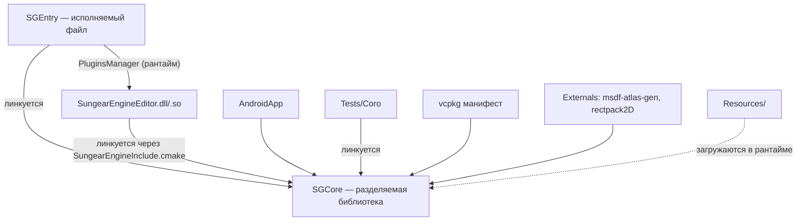

# 🏗️ PROJECT_STRUCTURE — Устройство проекта

## 📋 Оглавление

1. [Общая структура](#общая-структура)
2. [Ядро движка (SGCore)](#ядро-движка-sgcore)
3. [Точка входа (SGEntry)](#точка-входа-sgentry)
4. [Плагины](#плагины)
5. [Внешние зависимости](#внешние-зависимости)
6. [Система сборки](#система-сборки)
7. [Взаимосвязи компонентов](#взаимосвязи-компонентов)

---

## 📦 Общая структура

```
/
├── .claude/skills/          # Скиллы агента (см. SKILLS.md)
├── cmake/                   # Toolchain, платформы, пресеты, vcpkg-триплеты
├── docs/                    # Документация проекта (этот каталог)
├── documentation/           # Doxygen-выхлоп (en/html, en/latex) и картинки README
├── Externals/               # Вендореные внешние проекты (не через vcpkg)
├── Plugins/                 # Плагины: редактор (v1 и v2)
├── Resources/               # Ресурсы движка (шейдеры, ассеты по умолчанию)
├── Sources/                 # Исходный код: SGCore, SGEntry, AndroidApp
├── Tests/                   # Тестовые таргеты
├── vcpkg/                   # Сабмодуль vcpkg (менеджер зависимостей)
├── vcpkg.json               # Манифест зависимостей (версия движка здесь же)
├── CMakeLists.txt           # Корневой CMake
├── CMakePresets.json        # Подключает пресеты из cmake/presets/
├── CodingConvention.md      # Соглашение о кодировании Pixelfield
└── README.md                # Главный README
```

> ⚠️ Дерево сверено с репозиторием на **2026-08-16**. Если файл упомянут
> здесь, но отсутствует в checkout'е — верить checkout'у, а документ поправить.

Текущая версия движка — **0.14.0.8** (`vcpkg.json` → `version-string`).

---

## 🎮 Ядро движка (SGCore)

**Расположение**: `/Sources/SGCore/`

Собирается в разделяемую библиотеку `SGCore` (на Windows — `SGCore.dll`,
экспорт через `sgcore_export.h`). Модули — по каталогу на подсистему:

| Модуль | Назначение |
|--------|------------|
| `ECS/` | Обвязка над EnTT: `Registry`, `Component`, `EntitiesPool`, визиторы компонентов |
| `Render/` | Рендер: PBR-пайплайн (`PBRRP/`), батчинг, CSM-тени, менеджер пайплайнов |
| `Graphics/` | Графические API-абстракции (OpenGL 4.6 / GLES 3.2 через glad) |
| `Scene/` | Сцена, `EntityBaseInfo`, сохранение/загрузка сцен |
| `Memory/` | `AssetManager`, ассеты (модели, аудио, атласы), пакеты ассетов |
| `Serde/` | Сериализация/десериализация с поддержкой полиморфизма и шаринга данных |
| `CodeGeneration/` | Кодогенерация по мета-информации, собственный язык генератора (ANTLR4) |
| `MetaInfo/` | Мета-информация типов для кодогенерации и Serde |
| `Physics/` | Физика (Bullet3), параллельная обработка |
| `Transformations/` | Трансформации (`Transform`, `Controllable3D`), параллельный расчёт |
| `Audio/` | 2D/3D-звук (OpenAL): `AudioDevice`, `AudioSource`, `AudioListener` |
| `Animation/` | Скелеты и скелетные анимации с блендингом состояний |
| `UI/` | UI на XML + CSS (`UIDocument`), вектор через lunasvg |
| `ImGuiWrap/` | Обвязка ImGui (docking) для отладочного/редакторского UI |
| `Input/` | Ввод (пока только ПК, GLFW) |
| `PluginsSystem/` | `PluginsManager`, `IPlugin`, `DynamicLibrary` — динамическая загрузка плагинов |
| `Threading/` | Классы параллельных и асинхронных вычислений |
| `Coro/` | Корутины |
| `Navigation/` | Навигация (recastnavigation) |
| `AI/` | ИИ-подсистема (поведение агентов) |
| `Network/` | Сеть (Boost.Asio) |
| `Particles/` | Системы частиц |
| `ImportedScenesArch/` | Импорт внешних форматов сцен (FBX, OBJ, GLTF — через assimp) |
| `Math/` | Математика (поверх glm) |
| `Logger/` | Логирование (spdlog) |
| `CrashHandler/` | Обработчик падений (Boost.Stacktrace) |
| `Exceptions/` | Исключения движка |
| `ExternalAPI/` | Скриптинг/внешние API (Lua через sol2) |
| `Main/` | Ядро запуска: главный цикл, инициализация |
| `Actions/`, `Commands/`, `Motion/`, `Utils/` | Вспомогательные подсистемы |

> 📌 Назначения модулей `Actions/`, `Commands/`, `Motion/` выведены из названий —
> при работе с ними сверяться с кодом и уточнить этот документ.

---

## 🚪 Точка входа (SGEntry)

**Расположение**: `/Sources/SGEntry/` (`Entry.h` / `Entry.cpp`)

Исполняемый файл `SungearEngine`. Собирается при `SG_BUILD_ENTRY=ON`
(включён в корневом `CMakeLists.txt`). Инициализирует движок и загружает
плагин редактора через `PluginsManager`.

`/Sources/AndroidApp/` — обвязка запуска под Android (GLES 3.2, ввод пока
не поддержан).

---

## 🔌 Плагины

**Расположение**: `/Plugins/`

| Плагин | Что это |
|--------|---------|
| `SungearEngineEditor/` | Редактор движка. **Отдельный CMake-проект** со своими `CMakeLists.txt`, `CMakePresets.json`, `vcpkg.json`, `Resources/` |
| `SungearEngineEditor-v2/` | Новая версия редактора (со своими `MetaInfo/`, `Resources/`, `cmake/`) |

Редактор собирается тем же CMake-пресетом, что и ядро, и подгружается
в рантайме через `PluginsSystem` (см. [SYSTEM_DESIGN.md](./SYSTEM_DESIGN.md)).

---

## 📚 Внешние зависимости

### Через vcpkg (`/vcpkg.json`, vcpkg — сабмодуль)

| Библиотека | Зачем |
|------------|-------|
| `entt` | ECS |
| `bullet3` | Физика |
| `assimp` | Импорт FBX/OBJ/GLTF и др. |
| `glad` (GL 4.6 / GLES 3.2) | Загрузчик OpenGL |
| `glfw3` | Окна и ввод (не Android) |
| `glm`, `gli` | Математика, текстурные форматы (DDS) |
| `imgui` (docking, opengl3) | Отладочный/редакторский UI |
| `openal-soft` | Аудио |
| `freetype`, `lunasvg`, `skia` | Шрифты (TTF), SVG, растеризация |
| `pugixml`, `rapidjson` | XML (UI), JSON (Serde) |
| `spdlog` | Логи |
| `boost-asio`, `boost-stacktrace` | Сеть, стектрейсы падений |
| `antlr4` | Парсер языка кодогенератора |
| `sol2` + `lua` | Скриптинг |
| `recastnavigation` | Навигационные меши |
| `meshoptimizer`, `stb`, `libpng`, `brotli` | Оптимизация мешей, изображения, компрессия |
| `gtest` | Тесты (заявлен в манифесте, в таргетах пока закомментирован) |

### Вендореные (`/Externals/`)

| Проект | Как подключён |
|--------|---------------|
| `msdf-atlas-gen` | git-сабмодуль (ветка v1.3), `add_subdirectory` из корневого CMake |
| `rectpack2D` | вендорен, `add_subdirectory` |
| `antlr4` | вендореные заголовки |
| `stb_image_resize2.h` | одиночный заголовок |

---

## 🛠️ Система сборки

```
cmake/
├── set-toolchain.cmake        # Выбор toolchain (включается ДО project())
├── platform.cmake             # Определение платформы: SG_TARGET_OS_*, SG_TARGET_PLATFORM_PC
├── utils.cmake                # Утилиты, в т.ч. copy_sgcore_dlls() (сейчас тело закомментировано)
├── SungearEngineInclude.cmake # Подключение движка из внешних проектов (плагины)
├── SungearEngineConfig.cmake.in
├── presets/
│   ├── base-presets.json      # debug-x64-base / release-x64-base, пути через $env{SUNGEAR_SOURCES_ROOT}
│   ├── x64-windows.json       # {debug,release}-x64-windows-static-md
│   ├── x64-linux.json         # {debug,release}-x64-linux
│   └── arm64-android.json
└── vcpkg-triplets/            # Оверлей-триплеты vcpkg
```

Ключевые факты:

- **Стандарт C++23**, CMake ≥ 3.22.
- Всё зависит от переменной окружения **`SUNGEAR_SOURCES_ROOT`** — через неё
  пресеты находят toolchain vcpkg и оверлей-триплеты, а плагины — сам движок.
- Флаги `SG_BUILD_TESTS` и `SG_BUILD_ENTRY` **захардкожены в `ON`** в корневом
  `CMakeLists.txt` (не `option()`).
- В README пресеты названы `debug-host`/`release-host` — **фактические имена**
  `debug-x64-windows-static-md`, `release-x64-linux` и т.п. (см. `cmake/presets/`).
- Пост-сборочный таргет `auto_install` выполняет `cmake --install` после каждой
  сборки.

---

## 🧪 Тесты

**Расположение**: `/Tests/`

Единственный таргет — `SGCoroTest` (`Tests/Coro/`): проверка корутин, линкуется
с `SGCore`. GTest в `CMakeLists.txt` **закомментирован** — тест сейчас обычный
исполняемый файл, не gtest-набор. Подробнее — [DEV_RULES.md → Тестирование](./DEV_RULES.md#-тестирование).

---

## 🔗 Взаимосвязи компонентов



| Источник | Получатель | Тип связи | Описание |
|----------|------------|-----------|----------|
| `SGEntry` | `SGCore` | 🔗 Линковка | Точка входа поверх ядра |
| `SGEntry` | Плагин редактора | 🧩 Рантайм | Динамическая загрузка через `PluginsSystem` |
| `Plugins/*` | `SGCore` | 🔗 Линковка | Через `cmake/SungearEngineInclude.cmake` и `SUNGEAR_SOURCES_ROOT` |
| `Tests/*` | `SGCore` | 🔗 Линковка | Тестовые исполняемые файлы |
| `Resources/` | `SGCore` | 📁 Рантайм | Шейдеры и ассеты по умолчанию |

⚠️ На Windows `SGCore.dll` нужно копировать к исполняемому файлу вручную —
функция `copy_sgcore_dlls()` в `cmake/utils.cmake` сейчас закомментирована
(см. [INSTALL.md → Диагностика](./INSTALL.md#-диагностика-частых-проблем)).

---

*Документ описывает текущую структуру проекта и взаимосвязи между компонентами*
