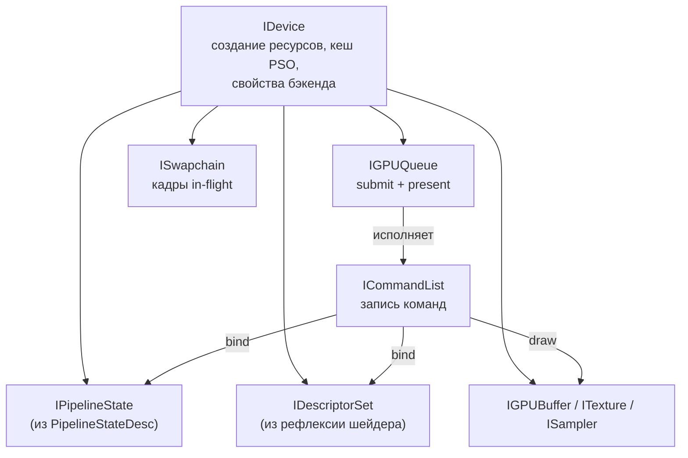

# 🧩 RHI_DESIGN — целевой рендер-интерфейс (Vulkan / DX12 / GL46)

Артефакт задачи **1.2** из [IMPLEMENTATION_PLAN.md](./IMPLEMENTATION_PLAN.md#этап-1-ревизия-rhi-и-шейдерный-пайплайн).
Вход — [RHI_AUDIT.md](./RHI_AUDIT.md). Статус: **на утверждении командой**
(критерий готовности задачи 1.2).

Утверждённые опорные решения (2026-08-16): CommandList-модель;
дескрипторные наборы по частоте обновления; фасад совместимости на время
миграции.

## 📋 Оглавление

1. [Цели и не-цели](#цели-и-не-цели)
2. [Модель объектов](#модель-объектов)
3. [Устройство и возможности](#устройство-и-возможности)
4. [Ресурсы и владение](#ресурсы-и-владение)
5. [PSO и кеш пайплайнов](#pso-и-кеш-пайплайнов)
6. [Модель биндинга](#модель-биндинга)
7. [Командные списки и кадр](#командные-списки-и-кадр)
8. [Барьеры](#барьеры)
9. [Шейдерный пайплайн SGSL](#шейдерный-пайплайн-sgsl)
10. [Фасад совместимости](#фасад-совместимости)
11. [Раскладка по файлам и порядок миграции](#раскладка-по-файлам-и-порядок-миграции)
12. [Открытые вопросы дизайна](#открытые-вопросы-дизайна)

---

## Цели и не-цели

**Цели:**

- Один интерфейс, под которым честно живут Vulkan, DX12 и GL46.
- **OpenGL — постоянный fallback-бэкенд** (решение 2026-08-16, по модели
  Unigine/Unity): GL46 на ПК и GLES на Android остаются полноправными
  реализациями RHI для обратной совместимости со старым железом и
  драйверами. Это накладывает ограничение на дизайн: **в интерфейс не
  попадает ничего, что GL46 не может исполнить** — либо фича есть на всех
  трёх бэкендах, либо она за `DeviceProperties`-флагом с деградацией.
- Проходы рендера не знают, какой бэкенд исполняет их команды.
- Существующие структуры состояний (`RenderState`, `BlendingState`,
  `MeshRenderState`) переиспользуются как части дескриптора PSO — код
  проходов, заполняющий их, менять не нужно.
- Миграция проходов постепенная, через фасад; движок собирается и работает
  на каждом шаге.

**Не-цели (сознательно за рамками этапа 1):**

- Рендер-граф с автоматическим выводом барьеров — барьеры явные, минимальный
  набор состояний (см. [Барьеры](#барьеры)).
- Многопоточная запись командных списков — дизайн её **допускает**
  (командный список привязан к потоку записи), но в этапах 1–2 запись
  однопоточная.
- Bindless, mesh shaders, RT — не закладываем, но не блокируем.

---

## Модель объектов



Замена по отношению к текущему коду:

| Сейчас | Становится |
|---|---|
| `IRenderer` (глобальный, стейт-машина) | `IDevice` (+ `IGPUQueue`, `ISwapchain`); `IRenderer` остаётся временно как фасад |
| `IVertexArray` (VAO) | `VertexInputDesc` внутри `PipelineStateDesc` + `bindVertexBuffer` в командном списке |
| `RenderState::use()` и кеш состояний | Поля `PipelineStateDesc`; выбор PSO из кеша |
| `IShader::useMatrix("имя", …)` | UBO/push constants через `IDescriptorSet`; поимённый доступ — только в фасаде |
| `IVertexBuffer` / `IIndexBuffer` / `IUniformBuffer` | Единый `IGPUBuffer` с `GPUBufferUsage` (vertex / index / uniform / storage / staging) |
| `bindScreenFrameBuffer()` | `ISwapchain::currentBackbuffer()` как обычная render target |
| немедленное удаление ресурсов | отложенное удаление в `IDevice` по завершению кадра |

---

## Устройство и возможности

```cpp
struct DeviceProperties
{
    GAPIType m_apiType { };

    // Координатные конвенции — запрашиваются, а не предполагаются (аудит, п. 5)
    bool m_originBottomLeft { };     // GL: true; Vulkan/DX12: false
    bool m_depthZeroToOne { };       // GL: false ([-1;1]); Vulkan/DX12: true
    bool m_ndcYFlipRequired { };     // Vulkan: true

    std::uint32_t m_framesInFlight = 2;
    std::uint32_t m_pushConstantsMaxSize = 128;

    // Возможности, различающиеся между fallback (GL) и современными бэкендами.
    // Проход обязан проверять флаг и деградировать, а не падать.
    bool m_supportsExplicitBarriers { };   // GL: false (no-op)
    bool m_supportsMultithreadedRecording { }; // GL: false
    bool m_supportsBindless { };           // этап 1: false везде
};

class SGCORE_EXPORT IDevice
{
public:
    virtual ~IDevice() = default;

    [[nodiscard]] virtual const DeviceProperties& getProperties() const noexcept = 0;

    [[nodiscard]] virtual Ref<IGPUBuffer> createBuffer(const GPUBufferDesc& desc) noexcept = 0;
    [[nodiscard]] virtual Ref<ITexture> createTexture(const TextureDesc& desc) noexcept = 0;
    [[nodiscard]] virtual Ref<ISampler> createSampler(const SamplerDesc& desc) noexcept = 0;

    // PSO из кеша: одинаковый desc — один и тот же объект
    [[nodiscard]] virtual Ref<IPipelineState> getOrCreatePipeline(const PipelineStateDesc& desc) noexcept = 0;

    [[nodiscard]] virtual Ref<ICommandList> createCommandList() noexcept = 0;

    [[nodiscard]] virtual IGPUQueue& graphicsQueue() noexcept = 0;
    [[nodiscard]] virtual ISwapchain& swapchain() noexcept = 0;

    // Отложенное удаление: ресурс умирает, когда кадр, где он использовался, завершён
    virtual void destroyDeferred(Ref<IGPUObject> object) noexcept = 0;
};
```

Проекции и вьюпорты во всех проходах строятся через `DeviceProperties`
(хелперы в `Math/`), а не через захардкоженное «bottom-left origin».

---

## Ресурсы и владение

- Фабрики возвращают `Ref<T>` (сейчас — сырые `T*`, аудит п. 8).
- Сэмплеры **отделены от текстур** (модель Vulkan/DX12); GL-бэкенд склеивает
  их внутри себя. Комбинированные точки `sampler2D` в SGSL остаются — рефлексия
  разворачивает их в пару texture+sampler на современных бэкендах.
- `IGPUBuffer` создаётся с `GPUBufferUsage` и `GPUMemoryAccess`
  (device-local / host-visible); staging-путь для загрузки — внутри бэкенда,
  наружу торчит только `uploadData(...)` в командном списке.
- Все GPU-объекты наследуют `IGPUObject` (имя для отладочных меток +
  участие в отложенном удалении).

---

## PSO и кеш пайплайнов

```cpp
struct PipelineStateDesc
{
    AssetRef<IShader> m_shader;              // SGSL-шейдер (все стадии)

    // Существующие структуры переиспользуются как есть:
    RenderState m_renderState { };           // depth / stencil
    BlendingState m_blendingState { };       // бленд (+ per-attachment)
    MeshRenderState m_meshRenderState { };   // cull / topology / patchVertices

    VertexInputDesc m_vertexInput { };       // замена VAO: атрибуты + шаг + инстансность
    RenderTargetsDesc m_renderTargets { };   // форматы attachment'ов + depth

    bool operator==(const PipelineStateDesc&) const noexcept = default;
};
```

- Ключ кеша — хеш `PipelineStateDesc` (все поля уже сравнимы, `operator==`
  у структур состояний есть).
- `getOrCreatePipeline` дёргается проходом на каждый дроу — попадание в кеш
  обязано быть дешёвым (открытая адресация, без итерации по map в горячем
  пути — правило конвенции).
- GL46-бэкенд внутри `bindPipeline` применяет те же `use()`-переходы, что
  сейчас, — с кешем «текущего PSO» вместо кеша отдельных состояний.
- Изменение `ShaderDefine`-ов шейдера (перекомпиляция) инвалидирует PSO
  этого шейдера — кеш слушает событие пересборки ассета.

---

## Модель биндинга

Четыре набора по частоте обновления (утверждено):

| Набор | Частота | Содержимое (текущие аналоги) |
|---|---|---|
| set 0 | кадр | камера/вью-матрицы (`m_viewMatricesBuffer`), программные данные (`m_programDataBuffer`), время |
| set 1 | проход | тени/CSM-каскады, параметры атмосферы, G-буферные входы, постпроцессинг |
| set 2 | материал | текстуры материала (`bindMaterialTextures`), факторы (`useMaterialFactors`) |
| set 3 | объект | пер-объектные данные, не влезшие в push constants |

- **Push constants** (≤ 128 байт) — для самого горячего пер-дроу: индекс
  трансформа в SSBO/UBO-массиве, индексы материала. Батчинг/инстансинг
  движка уже передают данные массивами — модель ложится на существующую
  практику.
- Раскладку наборов даёт **рефлексия SGSL** (см. ниже): шейдер объявляет
  блоки, транслятор назначает set/binding по категории. Проход не хардкодит
  номера биндингов — берёт их из рефлексии по имени блока.
- `IDescriptorSet` аллоцируются из пер-кадровых пулов (по числу кадров
  in-flight); обновление — `updateBuffer`/`updateTexture` по слоту.

---

## Командные списки и кадр

```cpp
class SGCORE_EXPORT ICommandList
{
public:
    virtual ~ICommandList() = default;

    virtual void begin() noexcept = 0;
    virtual void end() noexcept = 0;

    virtual void beginRenderPass(const RenderPassBeginDesc& desc) noexcept = 0;  // targets + load/store + clear
    virtual void endRenderPass() noexcept = 0;

    virtual void bindPipeline(const Ref<IPipelineState>& pipeline) noexcept = 0;
    virtual void bindDescriptorSet(std::uint8_t setIndex, const Ref<IDescriptorSet>& set) noexcept = 0;
    virtual void pushConstants(const void* data, std::uint32_t size, std::uint32_t offset) noexcept = 0;

    virtual void bindVertexBuffer(std::uint8_t slot, const Ref<IGPUBuffer>& buffer, std::uint64_t offset) noexcept = 0;
    virtual void bindIndexBuffer(const Ref<IGPUBuffer>& buffer, SGIndexType indexType) noexcept = 0;

    virtual void setViewport(const Viewport& viewport) noexcept = 0;
    virtual void setScissor(const Scissor& scissor) noexcept = 0;

    virtual void draw(std::uint32_t vertexCount, std::uint32_t instanceCount) noexcept = 0;
    virtual void drawIndexed(std::uint32_t indexCount, std::uint32_t instanceCount) noexcept = 0;

    virtual void transition(const Ref<IGPUObject>& resource, GPUResourceState newState) noexcept = 0;
    virtual void uploadData(const Ref<IGPUBuffer>& dst, const void* data, std::uint64_t size, std::uint64_t offset) noexcept = 0;

    // Readback (GPU → CPU): копирование текстуры в host-visible буфер; результат
    // читается через IGPUBuffer::map() после завершения кадра. Обязателен на всех
    // бэкендах — на нём держится смоук-тест (Tests/Smoke) и скриншоты редактора.
    virtual void copyTextureToBuffer(const Ref<ITexture>& src, const Ref<IGPUBuffer>& dst) noexcept = 0;
};
```

До появления RHI роль readback выполняет `IFrameBuffer::readAttachmentPixels()`
(добавлен для смоук-теста, реализован в GL); при миграции 1.5 он переезжает на
`copyTextureToBuffer` + `map`.

Правило readback'а (замечание Ilya, 2026-08-16): данные читаются **в родном
формате attachment'а** (`m_format` / `m_dataType`: R, RG, RGB, RGBA,
integer-варианты, float), без молчаливого приведения к RGBA8 — иначе
integer-attachment'ы (ID пикинга) читать нельзя, а одноканальные тихо
расширяются. Приведение к удобному формату — задача вызывающей стороны
(`AttachmentReadback` содержит раскладку). То же требование переносится на
`copyTextureToBuffer`: буфер получает байты в формате текстуры.

Кадровый цикл (владелец — `IDevice`/`ISwapchain`, вызывается из главного
цикла `CoreMain` вместо прямого `glfwSwapBuffers`):

```
beginFrame()                 // ждём fence кадра N-framesInFlight, acquire backbuffer
  └─ проходы пишут ICommandList (через IRenderPipeline как сейчас)
submit(commandLists)         // одна очередь, один сабмит на кадр (этапы 1–2)
present()                    // swapchain present + fence кадра
  └─ IDevice добивает очередь отложенного удаления за завершённые кадры
```

- GL46-бэкенд: `begin()/end()` — no-op, команды исполняются немедленно при
  записи (интерфейс это допускает — утверждено), `present()` =
  `glfwSwapBuffers`. Это **постоянная** стратегия GL-бэкенда, а не заглушка:
  GL и есть immediate-mode API, эмулировать в нём отложенное исполнение
  бессмысленно.
- Выбор бэкенда в рантайме: порядок предпочтения задаётся конфигурацией
  (по умолчанию Vulkan → GL46 на ПК; DX12 → Vulkan → GL46 на Windows после
  этапа 3); при провале `confirmSupport()`/инициализации — автоматический
  откат к следующему в списке с записью причины в лог. Пользователь может
  принудительно выбрать GL флагом запуска — для диагностики драйверных
  проблем.
- Пер-кадровые ресурсы (дескрипторные пулы, кольца динамических UBO) —
  по `m_framesInFlight`.

---

## Барьеры

Явные, но минимальный словарь состояний — не полный Vulkan:

```cpp
enum class GPUResourceState
{
    SGG_STATE_UNDEFINED,
    SGG_STATE_RENDER_TARGET,
    SGG_STATE_DEPTH_WRITE,
    SGG_STATE_SHADER_READ,
    SGG_STATE_TRANSFER_SRC,
    SGG_STATE_TRANSFER_DST,
    SGG_STATE_PRESENT
};
```

- Типовой паттерн движка — «отрендерил в текстуру → читаю в следующем
  проходе» (CSM, постпроцессинг, LayeredFrameReceiver) — покрывается одним
  `transition()` между проходами.
- GL46: no-op. Vulkan: image/buffer memory barriers. DX12: resource barriers.
- Бэкенд в Debug (`SUNGEAR_DEBUG`) валидирует переходы (использование в
  неправильном состоянии — лог ошибки), чтобы ловить пропущенные барьеры на
  GL, где они не стреляют.

---

## Шейдерный пайплайн SGSL

```
                     ┌────────────── dev-режим: hot reload ──────────────┐
SGSL (.sgshader) → SGSLETranslator → GLSL 450 → glslang → SPIR-V + рефлексия
                                                            │
                       ┌────────────────────────────────────┼───────────────────┐
                       ▼                                    ▼                   ▼
                GL46: GL_ARB_gl_spirv            Vulkan: как есть      DX12: spirv-cross → HLSL → DXC → DXIL
                (fallback: GLSL напрямую)
```

- Транслятор SGSL уже генерирует GLSL (`Utils/SGSL/SGSLETranslator`) —
  добавляется стадия glslang и **рефлексия** (SPIRV-Reflect): списки блоков,
  их set/binding, push-constant-диапазоны, вершинные атрибуты. Результат
  рефлексии — часть скомпилированного шейдер-ассета (сериализуется через
  Serde в пакеты ассетов).
- **Между транслятором и glslang стоит проход «вулканизации»**
  (`Utils/SGSL/SGSLEVulkanizer`, реализован 2026-08-17): корпус шейдеров
  написан в GL-стиле (свободные `uniform` вне блоков, сэмплеры и UBO без
  `binding`, `gl_FragColor`), что запрещено в Vulkan-GLSL. Проход механически
  собирает свободные юниформы стадии в `layout(std140, set, binding) uniform
  SGLegacyUniforms_<stage> {…} sg_SGLegacyUniforms_<stage>;` и переписывает
  обращения в `instance.member`; назначает `set/binding` сэмплерам/UBO/TBO
  (явные сохраняются), переносит `#if`-условия объявлений на члены блока,
  ставит блок не раньше объявления используемых `struct`-типов, заменяет
  `gl_FragColor`/`gl_VertexID`. Обрабатывается вся программа сразу — биндинги
  едины во всех стадиях. **Блок пер-стадийный, а не общий**: стадия знает
  только свои типы, а члены анонимных блоков глобальны для программы и glslang
  не линкует коллизии. Это и есть «legacy-UBO» фасада: `IShader::useX("имя", …)`
  на Vulkan/DX12 пишет по имени во **все** блоки, где есть такой член;
  раскладка (offset/size) — из `ShaderReflection`.
- **Компиляция и рефлексия** — `Graphics/SPIRV/SPIRVCompiler` (glslang, все
  стадии в одном `TProgram` с `mapIO()` для авто-локаций in/out) и
  `ShaderReflection` (SPIRV-Reflect; биндинги с масками стадий, члены блоков,
  вершинные входы, push constants). Проверено 2026-08-17: 23/23 программ
  корпуса дают валидный SPIR-V.
- Дефайны (`ShaderDefine`, `#attribute`) должны быть **приписаны к коду до
  вулканизации** — так же, как GL-бэкенд приписывает их перед компиляцией;
  иначе `#if`-условия членов не совпадут с реальной компиляцией.
- Продакшен: компиляция офлайн при сборке пакета ассетов; кеш по хешу
  исходника+дефайнов. Dev: компиляция на лету + существующий
  `m_autoRecompile`.
- `ShaderDefine`-механика сохраняется — дефайны участвуют в ключе кеша
  скомпилированного варианта (это уже так для GL, распространяется на SPIR-V).

---

## Фасад совместимости

Утверждено: старый API работает поверх нового, проходы мигрируют по одному.

- `IRenderer` остаётся, но превращается в фасад над `IDevice` + неявным
  `ICommandList` кадра:
  - `renderMeshData(...)` → `getOrCreatePipeline` (desc собирается из
    кешированных `RenderState`/`MeshRenderState` + шейдер + layout меша)
    → bind + draw в текущий командный список;
  - `useState/useBlendingState/useMeshRenderState` → просто обновляют
    кешированные структуры (как сейчас), реальное применение — в момент дроу;
  - `IShader::useMatrix("имя", …)` и прочие поимённые сеттеры → пишут в
    **legacy-UBO** шейдера: буфер, автоматически собранный рефлексией из
    всех «свободных» юниформов (транслятор SGSL заворачивает их в один блок).
- Фасад помечается `[[deprecated]]` после миграции всех проходов (конец
  задачи 1.5); новые проходы пишутся сразу на `ICommandList`.
- ⚠️ Не путать: **фасад — временный, GL-бэкенд — постоянный.** Фасад
  (`IRenderer`, поимённые юниформы) исчезает после миграции проходов; GL46
  как реализация `IDevice`/`ICommandList` остаётся навсегда и поддерживается
  наравне с Vulkan/DX12.
- Порядок миграции проходов (эталон — задача 1.5, GL46): screen quad /
  вывод на экран → PBRRP geometry → CSM → PostProcess → остальные
  (Atmosphere, Decals, Terrain, Volumetric, Picking, Batching, UI/Text,
  DebugDraw, Gizmos).

---

## Состояние реализации (2026-08-17)

- Каркас — `Sources/SGCore/Graphics/RHI/` (интерфейсы выше, 1:1 с этим
  документом; отличия: `PipelineStateDesc::m_program` — `Ref<IShaderProgram>`
  (RHI-объект из `IDevice::createShaderProgram`), а не `AssetRef<IShader>`;
  `RenderPassBeginDesc` на время миграции принимает legacy-`IFrameBuffer`).
- Эталонная реализация — GL46 (`Sources/SGCore/Graphics/API/GL/GL46/RHI/`):
  immediate-mode командный список, VAO = vertex input в PSO, DSA-буферы,
  рефлексия из GL program interface. Доступ — `IRenderer::getDevice()`.
- **Единый шейдерный путь**: `SGSLEVulkanizer` с `Target::OPENGL` даёт GLSL,
  которую GL 4.6 принимает как есть (`layout(binding=N)` без `set`, `gl_VertexID`);
  `Target::VULKAN` — тот же код для glslang. Проверено `Tests/RHI` (`SGRHITest`).
- Не реализовано на GL: push constants (предупреждение; фасад заменит мини-UBO),
  `transition` — no-op по дизайну.
- **Мигрированные проходы**: (1) вывод текстуры на экран — `Graphics/RHI/ScreenBlit`
  через `RHIShaderLoader` (тот самый путь `.sgshader` → RHI-программа, которым
  пойдут все проходы; для explicit API он же компилирует SPIR-V). Проверка:
  `SGRHITest` (экран = текстура байт в байт) и смоук на gl46 (0 %).
- **Мигрирован шейдерный объект** (шаг 2): `GL46Shader` компилирует вулканизированный
  GLSL и маршрутизирует `IShader::useX("имя", …)` в legacy-UBO по рефлексии — это и
  есть фасад из раздела выше, реализованный не поверх `IDevice`, а внутри legacy-класса:
  проходы не менялись, данные уже текут по Vulkan-модели (23/23 программ, смоук 0 %).
  Биндинги вулканизатора начинаются с 8: точки 1–4 заняты legacy-`IUniformBuffer`
  (`glUniformBlockBinding` перекрывает `layout(binding)` — допустимо в GL).
- **Мигрированы меши** (шаг 3): `renderMeshData` на GL46 рисует через RHI —
  `IMeshData::m_rhi` (буферы + `VertexInputDesc`, строится из `IVertexBuffer::getAttributes()`,
  которые теперь записывает базовый класс), PSO из программы привязанного legacy-шейдера
  (`GL46LegacyProgram` — не владеющий адаптер над `GL46ProgramBase`), кешированных
  состояний и раскладки меша; `renderArray`/instanced (7 точек: батчинг, экранные
  квады) — пока legacy.
- Правило миграции прохода: legacy-реализация остаётся как откат (`GL46Renderer`
  падает на неё, если RHI-проход не инициализировался), проход считается
  перенесённым только при 0 % расхождений смоука на GL46.

## Раскладка по файлам и порядок миграции

Новый код живёт рядом со старым, в том же модуле (эволюция на месте, без
big-bang-переименований):

```
Sources/SGCore/Graphics/API/
├── IDevice.h / .cpp                # новое
├── ICommandList.h                  # новое
├── IPipelineState.h                # новое (+ PipelineStateDesc)
├── IDescriptorSet.h                # новое
├── ISwapchain.h                    # новое
├── IGPUBuffer.h                    # новое (поглощает IVertex/IIndex/IUniformBuffer)
├── GPUResourceStates.h             # новое
├── IRenderer.h                     # остаётся фасадом, затем deprecated
├── RenderState.h                   # остаётся (часть PipelineStateDesc)
├── GL/                             # GL46 мигрирует на новый RHI (задача 1.5); постоянный fallback, GL4 удаляется
├── Vulkan/                         # переписывается с нуля (этап 2); скелет 2023 г. удаляется
└── DX12/                           # этап 3
```

Соответствие задачам плана: 1.3 — `GAPIType` + выбор бэкенда; 1.4 — блок
[шейдерного пайплайна](#шейдерный-пайплайн-sgsl); 1.5 — GL46 на новом RHI +
миграция проходов; 1.6 — смоук-сцена.

---

## Открытые вопросы дизайна

| # | Вопрос | Предлагаемое решение | Когда решать |
|---|---|---|---|
| 1 | Динамические render passes (Vulkan 1.3 `dynamic_rendering`) или классические VkRenderPass? | `dynamic_rendering`: проще, ложится на `beginRenderPass`-интерфейс, соответствует DX12; минимальная версия Vulkan — 1.3 | старт этапа 2 |
| 2 | GL46: принимать SPIR-V через `GL_ARB_gl_spirv` или продолжать кормить GLSL? | Пробовать SPIR-V (единый артефакт), fallback на GLSL за флагом — расхождения драйверов известны | задача 1.5 |
| 3 | Минимальные требования современных бэкендов: Vulkan 1.3, DX12 FL 12.0 | Принять: старое железо обслуживает **постоянный GL46/GLES fallback** (решено, вопрос №2 плана), поэтому современные бэкенды могут требовать свежие версии без потери пользователей | утверждение этого документа |
| 5 | ~~Какой GL-бэкенд становится постоянным fallback'ом~~ | ✅ **Решено 2026-08-17: GL46.** `GL46Renderer` починен (не хватало дефайна `SG_GLSL4` в `createShader`; заглушка `GL46Texture2D` удалена) и стал GL4-реализацией на контексте 4.6 — смоук совпадает с GL4 попиксельно. При миграции 1.5 новый RHI реализуется в GL46 (DSA, `ARB_gl_spirv` — пообъектно под смоук-контролем); `GL4Renderer` остаётся вторым в списке до появления рантайм-отката (1.3a), затем решается его судьба | закрыт |
| 4 | `IMeshData` и `Batching` — адаптировать к `VertexInputDesc` в этапе 1 или при миграции проходов? | При миграции проходов (1.5), через фасад | задача 1.5 |

---

*После утверждения документ становится источником истины для задач 1.3–1.6; расхождения реализации с ним правятся в обе стороны осознанно.*
