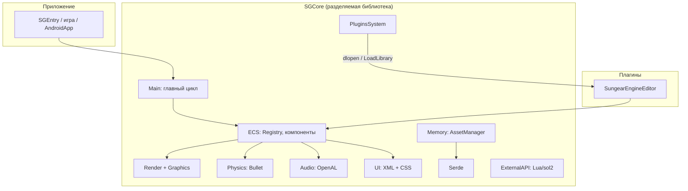

# 🏛️ SYSTEM_DESIGN — Архитектура движка

## 📋 Оглавление

1. [Обзор архитектуры](#обзор-архитектуры)
2. [Ядро: ECS и главный цикл](#ядро-ecs-и-главный-цикл)
3. [Система плагинов](#система-плагинов)
4. [Рендер](#рендер)
5. [Пайплайн ассетов](#пайплайн-ассетов)
6. [Serde и кодогенерация](#serde-и-кодогенерация)
7. [Параллельность](#параллельность)
8. [Платформенный слой](#платформенный-слой)

> ⚠️ Раздел сверен с кодом на **2026-08-16** на уровне структуры каталогов и
> корневых CMake-файлов. Источник истины — код (`Sources/SGCore/`), а не этот
> документ. Утверждения, помеченные «уточнить», требуют сверки с исходниками
> при первой работе с соответствующей подсистемой.

---

## 🎯 Обзор архитектуры

### Архитектурный стиль

Sungear Engine — кроссплатформенный игровой движок на **C++23**:

- **SGCore** — ядро в виде разделяемой библиотеки: ECS, рендер, физика, аудио,
  UI, сериализация, сеть, скриптинг.
- **SGEntry** — тонкий исполняемый файл: инициализация ядра + загрузка плагинов.
- **Плагины** — функциональность поверх ядра (редактор — это плагин, а не часть
  ядра).
- **Данные — через ECS**: сцена — это реестр сущностей (EnTT), подсистемы
  обрабатывают компоненты.

### Диаграмма контекста

---

## 🧩 Ядро: ECS и главный цикл

- ECS построена поверх **EnTT** (`Sources/SGCore/ECS/`): собственные `Registry`,
  `Component`, `EntitiesPool`, `SingletonComponent` и визиторы компонентов
  (`IComponentVisitor`, `Visitors`).
- Сцена (`Scene/Scene.h`) владеет реестром; `EntityBaseInfo` — базовая
  информация о сущности. Сцены сохраняются и загружаются (через Serde).
- Игровая логика и подсистемы движка работают как обработчики над реестром;
  трансформации и физика считаются параллельно (см. [Параллельность](#параллельность)).

---

## 🔌 Система плагинов

**Расположение**: `Sources/SGCore/PluginsSystem/`

| Класс | Роль |
|-------|------|
| `PluginsManager` | Загрузка/выгрузка плагинов, реестр загруженного |
| `IPlugin` | Интерфейс плагина: точки входа жизненного цикла |
| `DynamicLibrary` | Кроссплатформенная обёртка над dll/so |
| `PluginProject`, `PluginWrap` | Описание проекта плагина и обёртка загруженного экземпляра |

Ключевое решение (текущее): **редактор — это плагин**, а не отдельная сборка
движка. 🎯 Целевое состояние другое: редактор выносится за явную C-ABI границу
поверх ядра, UI — на C# (XAML/MVVM: Avalonia или WPF), тот же слой биндингов
в перспективе обслуживает C#-скриптинг игр по модели Unity (этапы 4–6 в
[IMPLEMENTATION_PLAN.md](./IMPLEMENTATION_PLAN.md#-план-работ-по-этапам)).
`SGEntry` при старте загружает плагин редактора; игра без редактора использует
то же ядро. Плагины — отдельные CMake-проекты, линкуемые с движком через
`cmake/SungearEngineInclude.cmake` (путь берётся из `SUNGEAR_SOURCES_ROOT`),
поэтому **пресет сборки плагина обязан совпадать с пресетом ядра** — иначе
несовместимые бинарники.

---

## 🎨 Рендер

**Расположение**: `Sources/SGCore/Render/`, `Sources/SGCore/Graphics/`

- **Forward PBR** на Cook-Torrance BRDF (`Render/PBRRP/PBRRenderPipeline.h`);
  пайплайны сменные — управляются `RenderPipelinesManager`.
- Графические API: **OpenGL 4.6** (ПК) / **GLES 3.2** (Android) через glad.
- **Абстракция API** — `Graphics/API/`: интерфейсы `IRenderer`, `IShader`,
  `ITexture2D`, `IFrameBuffer`, `IVertexArray` и др.; бэкенд выбирается через
  `GAPIType` (GL4, GL46, GLES2/3, VULKAN). Каталог `Graphics/API/Vulkan/` —
  нерабочий скелет 2023 г. (зависимости vulkan в `vcpkg.json` нет).
- 🎯 **Целевое направление** (утверждено 2026-08-16): основными API становятся
  **Vulkan** (Windows/Linux/Android) и **DirectX 12** (Windows); текущая
  абстракция скроена под GL (VAO, глобальный `RenderState`) и перед этим
  проходит ревизию под command lists / PSO / дескрипторы. Аудит —
  [RHI_AUDIT.md](./RHI_AUDIT.md), дизайн целевого RHI —
  [RHI_DESIGN.md](./RHI_DESIGN.md), этапы и порядок — в
  [IMPLEMENTATION_PLAN.md](./IMPLEMENTATION_PLAN.md#-дорожная-карта).
- Реализовано (по README, сверять с кодом при работе): декали, террейн с
  тесселяцией и displacement, atmosphere scattering, стохастическая
  прозрачность, объёмный постпроцессинг, пикинг сущностей, дебаг-рендер,
  батчинг (`Render/Batching/`), каскадные теневые карты (`Render/ShadowMapping/CSM/`).
- Октодерево с автоматическим разбиением — для отсечения и ускорения запросов
  по сцене.
- Свой add-on над GLSL (шейдеры лежат в `Resources/`).

---

## 📦 Пайплайн ассетов

**Расположение**: `Sources/SGCore/Memory/`, `Sources/SGCore/ImportedScenesArch/`

- Центральная точка — `AssetManager`; типы ассетов — в `Memory/Assets/`
  (`ModelAsset`, `AudioTrackAsset`, `Atlas` и др.).
- Импорт внешних сцен (FBX, OBJ, GLTF, …) — через assimp
  (`ImportedScenesArch/`).
- Форматы: векторные SVG (lunasvg) и TTF (freetype + msdf-atlas-gen для
  атласов), растровые JPG/PNG/DDS (stb, libpng, gli).
- Поддерживаются **пакеты ассетов**: создание и загрузка.
- Меши оптимизируются meshoptimizer'ом (уточнить, на каком этапе пайплайна).

---

## 🧬 Serde и кодогенерация

**Расположение**: `Sources/SGCore/Serde/`, `CodeGeneration/`, `MetaInfo/`

- **Serde** — собственная система сериализации: поддержка полиморфных классов
  и шаринга данных между объектами. Спеки для стандартных типов —
  `Serde/StandardSerdeSpecs/`, реализации — `Serde/Implementations/`.
  JSON-бэкенд — rapidjson.
- **Кодогенерация**: собственный язык генератора, парсится ANTLR4
  (`CodeGeneration/`); мета-информация о типах — `MetaInfo/`. Генерация
  используется, в частности, для Serde-спеков компонентов (уточнить охват).
- Связка «MetaInfo → кодогенерация → Serde» — то, что позволяет сохранять и
  загружать сцены без ручного написания сериализации под каждый компонент.

---

## ⚙️ Параллельность

**Расположение**: `Sources/SGCore/Threading/`, `Coro/`

- Набор классов для параллельных и асинхронных вычислений (`Threading/`).
- **Корутины** (`Coro/`) — единственная подсистема, на которую сейчас есть
  тестовый таргет (`Tests/Coro`).
- Физика и трансформации считаются **параллельно** основному потоку
  (заявлено в README; модель синхронизации уточнить в
  `Physics/` и `Transformations/` перед изменениями там).

---

## 🖥️ Платформенный слой

| Платформа | Статус | Особенности |
|-----------|--------|-------------|
| Windows | ✔️ | GLFW, OpenGL 4.6, MSVC (`/utf-8`, `/bigobj`, `/EHsc`), `SGCore.dll` копируется к exe вручную |
| Linux | ✔️ | GLFW, `-rdynamic`, libbacktrace для стектрейсов |
| Android | ⚠️ частично | GLES 3.2, `Sources/AndroidApp/`, ввод не поддержан, skia/msdf-skia выключены |
| MacOS | 🔨 в работе | — |
| iOS, Web | ❌ | — |

Определение платформы — в `cmake/platform.cmake` (`SG_TARGET_OS_*`,
`SG_TARGET_PLATFORM_PC`); в коде — макросы вида `SG_PLATFORM_OS_WINDOWS`.

Прочее платформенное:

- Крашхендлер на Boost.Stacktrace: WinDbg на Windows, addr2line/backtrace на
  Linux/macOS.
- Сеть — Boost.Asio (`Network/`).
- Скриптинг — Lua через sol2 (`ExternalAPI/`).
- Навигация — recastnavigation (`Navigation/`).

---

*Документ описывает архитектурные решения движка; при расхождении с кодом — верить коду и править документ*
